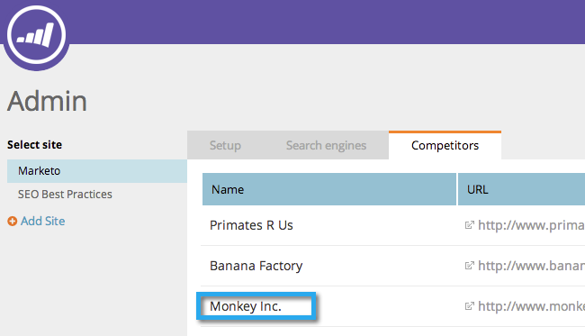

# SEO - Mitbewerber hinzufügen {#seo-add-competitors}

Wenn Sie Mitbewerber hinzufügen, können Sie verfolgen, wie diese mit denselben Keywords und eingehenden Links arbeiten, die Sie überwachen möchten.

>[!NOTE]
>
>**Administratorberechtigungen erforderlich**

1. Navigieren Sie zum Bereich **[!UICONTROL Admin]**.

   

1. Klicken Sie auf **[!UICONTROL Registerkarte]** Konkurrenten“.

   

1. Klicken Sie **[!UICONTROL Mitbewerber hinzufügen]**.

   

1. Geben Sie **[!UICONTROL (Name]** und **[!UICONTROL URL]** Ihres Mitbewerbers ein.

   

   Sie sollten nun Ihren Konkurrenten in der Liste sehen.

   

   >[!MORELIKETHIS]
   >
   >* [Keywords hinzufügen](/help/marketo/product-docs/additional-apps/seo/keywords/seo-add-keywords.md){target="_blank"}
   >* [Grundlegendes zu Schlüsselwörtern (Ansicht des Mitbewerbers)](/help/marketo/product-docs/additional-apps/seo/keywords/seo-understanding-keywords.md){target="_blank"}
