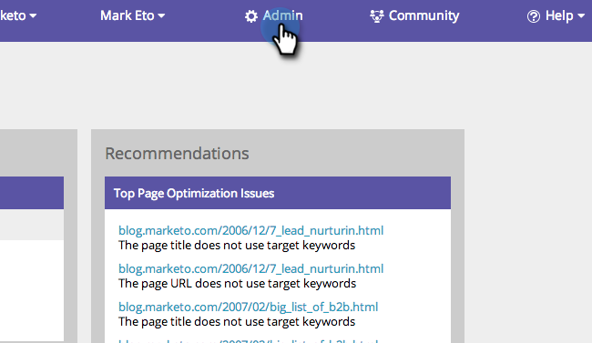

# SEO - Wettbewerber hinzufügen {#seo-add-competitors}

Durch das Hinzufügen von Konkurrenten können Sie verfolgen, wie sie bei denselben Keywords und eingehenden Links, die Sie überwachen, abschneiden.

>[!NOTE]
>
>**Erforderliche Administratorberechtigungen**

1. Navigieren Sie zu **Admin** Abschnitt.

   

1. Klicken Sie auf **Wettbewerber** Registerkarte.

   

1. Klicken **Konkurrenten hinzufügen**.

   

1. Geben Sie im Feld **Name** und **URL** Ihres Konkurrenten.

   

   Hoch fünf! Ihr solltet nun euren Konkurrenten in der Liste sehen.

   

   Herzlichen Glückwunsch! Du bist einen Schritt näher daran, es völlig zu zerdrücken.

   >[!MORELIKETHIS]
   >
   >* [Suchbegriffe hinzufügen](/help/marketo/product-docs/additional-apps/seo/keywords/seo-add-keywords.md){target=&quot;_blank&quot;}
   >* [Suchbegriffe verstehen (Konkurrentenansicht)](/help/marketo/product-docs/additional-apps/seo/keywords/seo-understanding-keywords.md){target=&quot;_blank&quot;}

