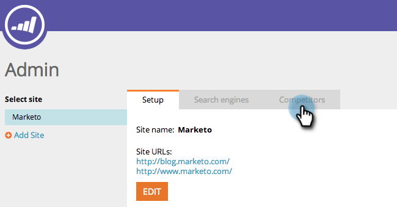

# SEO - Wettbewerber hinzufügen {#seo-add-competitors}

Durch das Hinzufügen von Konkurrenten können Sie verfolgen, wie sie bei denselben Keywords und eingehenden Links, die Sie überwachen, abschneiden.

>[!NOTE]
>
>**Erforderliche Administratorberechtigungen**

1. Navigieren Sie zum **[!UICONTROL Admin]**-Bereich.

   

1. Klicken Sie auf **[!UICONTROL Wettbewerber]** Registerkarte.

   

1. Klicks **[!UICONTROL Konkurrenten hinzufügen]**.

   

1. Geben Sie im Feld **[!UICONTROL Name]** und **[!UICONTROL URL]** Ihres Konkurrenten.

   

   Ihr solltet nun euren Konkurrenten in der Liste sehen.

   

   >[!MORELIKETHIS]
   >
   >* [Suchbegriffe hinzufügen](/help/marketo/product-docs/additional-apps/seo/keywords/seo-add-keywords.md){target="_blank"}
   >* [Suchbegriffe verstehen (Konkurrentenansicht)](/help/marketo/product-docs/additional-apps/seo/keywords/seo-understanding-keywords.md){target="_blank"}
