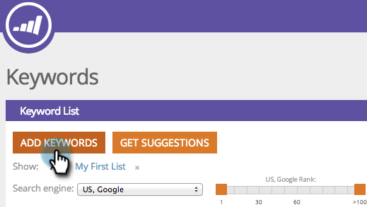

# SEO - Verwalten von Listen {#seo-managing-lists}

Sie können Elemente zu Listen hinzufügen, wenn Sie Suchbegriffe, Seiten, Seitenprobleme oder eingehende Links hinzufügen. Mit Listen können Sie organisiert bleiben und Berichte so filtern, dass nur Daten aus dieser Liste angezeigt werden. Hier ist, wie man sie macht.

1. Klicks **[!UICONTROL Suchbegriffe hinzufügen]**.

   >[!NOTE]
   >
   >Dies funktioniert auf die gleiche Weise beim Hinzufügen von Seiten, Seitenproblemen und eingehenden Links.

   

1. Geben Sie den Suchbegriff ein. Wählen Sie aus der Dropdown-Liste eine Liste aus, der Sie sie hinzufügen möchten.

   

   >[!TIP]
   >
   >Sie können eine neue Liste in der Dropdown-Liste erstellen. Geben Sie einen Titel ein und drücken Sie die Eingabetaste.

1. Klicks **[!UICONTROL Speichern]**.

   
