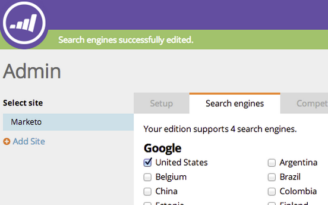

# SEO - Region/Land für Ihre Suchmaschine auswählen {#seo-pick-region-country-for-your-search-engine}

SEO-Administratoren können die Region für die Suchmaschine auswählen, für die Sie Suchbegriffeinstufungsinformationen erhalten möchten.

>[!NOTE]
>
>**Erforderliche Administratorberechtigungen**

1. Navigieren Sie zu **Admin** Abschnitt.

1. Klicken Sie auf **Suchmaschinen** Registerkarte.

   

1. Wählen Sie das Land/die Stadt aus, für das/die Sie optimieren möchten, und klicken Sie auf **Speichern**.

>[!NOTE]
>
>Standardmäßig können Sie ein Land für eine Suchmaschine verwenden. Wenn Sie mehr benötigen, wenden Sie sich an Ihren Vertriebsmitarbeiter.

Ausgezeichnete Arbeit. Sie sehen nun Suchbegriffränder für das Land oder die Stadt Ihrer Wahl.

>[!MORELIKETHIS]
>
>* [Grundlegendes zum Dashboard: SEO-Schnappschuss](/help/marketo/product-docs/additional-apps/seo/understanding-seo/understanding-the-seo-dashboard-seo-snapshot.md){target=&quot;_blank&quot;}
>* [Grundlegendes zum Dashboard: SEO Recommendations](/help/marketo/product-docs/additional-apps/seo/understanding-seo/understanding-the-seo-dashboard-seo-recommendations.md){target=&quot;_blank&quot;}

