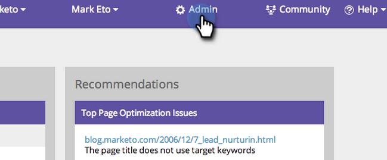

# SEO – Auswählen von Region/Land für Ihre Suchmaschine {#seo-pick-region-country-for-your-search-engine}

SEO-Administratoren können die Region für die Suchmaschine auswählen, für die Sie Keyword-Ranking-Informationen erhalten möchten.

>[!NOTE]
>
>**Administratorberechtigungen erforderlich**

1. Navigieren Sie zum Abschnitt **[!UICONTROL Admin]**.

1. Klicken Sie auf **[!UICONTROL Registerkarte]** Suchmaschinen“.

   

1. Wählen Sie das Land/die Stadt aus, für das/die Sie optimieren möchten, und klicken Sie auf **[!UICONTROL Speichern]**.

>[!NOTE]
>
>Standardmäßig kann für eine Suchmaschine ein Land verwendet werden. Wenn Sie weitere Informationen benötigen, wenden Sie sich an Ihren Vertriebsmitarbeiter.

Sehen Sie sich jetzt die Keyword-Ränge für das Land oder die Stadt Ihrer Wahl an.

>[!MORELIKETHIS]
>
>* [Das Dashboard verstehen: SEO Momentaufnahme](/help/marketo/product-docs/additional-apps/seo/understanding-seo/understanding-the-seo-dashboard-seo-snapshot.md){target="_blank"}
>* [Das Dashboard verstehen: SEO Recommendations](/help/marketo/product-docs/additional-apps/seo/understanding-seo/understanding-the-seo-dashboard-seo-recommendations.md){target="_blank"}
