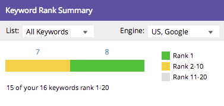
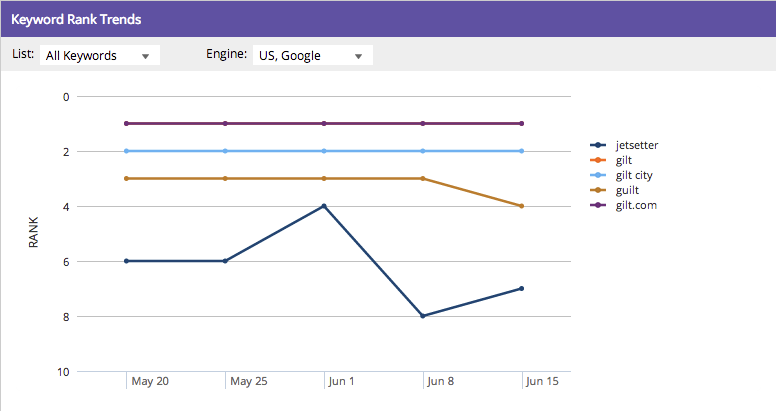

# Grundlegendes zum SEO Dashboard: SEO Momentaufnahme {#understanding-the-seo-dashboard-seo-snapshot}

Verwenden Sie das Dashboard, um einen Überblick darüber zu erhalten, wie der Keyword-Rang im Trend liegt und wie gut Ihre Site für SEO optimiert ist.

Um herauszufinden, worauf Sie sich konzentrieren müssen, um Ihre SEO-Bemühungen zu verbessern, verwenden [[!UICONTROL  Abschnitt ]](/help/marketo/product-docs/additional-apps/seo/understanding-seo/understanding-the-seo-dashboard-seo-recommendations.md)Recommendations“ dieses Dashboards.

## [!UICONTROL Keyword-Rang-Zusammenfassung] {#keyword-rank-summary}

In diesem Abschnitt erfahren Sie, wie Ihre Site für die [Keywords, die Sie ansprechen“, ](/help/marketo/product-docs/additional-apps/seo/keywords/seo-add-keywords.md) wird.

| Farbe | Rang |
|---|---|
| Grün | &#x200B;1. Ergebnis in der Suche |
| Gelb | &#x200B;2. - 10. Ergebnis der Suche |
| Grau | &#x200B;11. - 20. Suchergebnis |

>[!TIP]
>
>Sie können auch die Leistung einer [spezifischen Liste](/help/marketo/product-docs/additional-apps/seo/keywords/seo-add-remove-keywords-from-a-list.md) von Schlüsselwörtern anzeigen. Klicken Sie auf die Dropdown-Liste und wählen Sie aus, welches davon Sie interessiert.

>[!NOTE]
>
>Daten werden nur für Schlüsselwörter der Rangfolgen 1-100 angezeigt.

## [!UICONTROL Durchschnittlicher Wert für die Seitenoptimierung] {#average-page-optimization-score}

Der [!UICONTROL Average Page Optimization Score] ist ein proprietärer Marketo-Wert, der alle Seiten auf Ihrer Site auf einer Skala von 1 bis 100 misst.

Sie basiert auf einer Zusammenstellung von Dutzenden von Best Practices. Ein Wert von 70 oder höher zeigt eine gut optimierte Site an.

>[!TIP]
>
>Außerdem können Sie den Optimierungswert für bestimmte Listen von Seiten einsehen. Verwenden Sie die Dropdown-Liste und wählen Sie die für Sie interessante aus.

## [!UICONTROL Trends beim Keyword-Rang] {#keyword-rank-trends}

Das Diagramm [!UICONTROL Keyword-Ranking]Trends“ zeigt Ihre Keywords mit den fünf höchsten monatlichen Suchvolumina an und zeigt auf, wie sie im Laufe der Zeit abschneiden.

>[!TIP]
>
>Sie können Keywords aus diesem Diagramm entfernen, indem Sie darauf klicken. Probieren Sie es aus! Das Diagramm wird dynamisch neu erstellt.

Sehen Sie sich den [!UICONTROL Recommendations] Abschnitt dieses Dashboards an.

>[!MORELIKETHIS]
>
>[Das Dashboard verstehen: SEO Recommendations](/help/marketo/product-docs/additional-apps/seo/understanding-seo/understanding-the-seo-dashboard-seo-recommendations.md)
