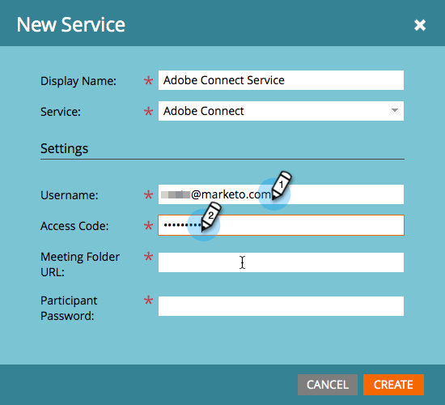

# Hinzufügen von Adobe Connect as a [!DNL LaunchPoint] Dienst {#add-adobe-connect-as-a-launchpoint-service}

Marketo verwaltet die Registrierung und Teilnahme Ihres Adobe Connect-Webinars.

>[!NOTE]
>
>**Erforderliche Administratorberechtigungen**

>[!NOTE]
>
>Für diesen Schritt sind ein bestehendes Abonnement für Adobe Connect und Administratorrechte erforderlich. Verwenden Sie die folgenden Einstellungen: Benutzername, Kennwort, Teilnehmerkennwort und Sitzungsordner-URL.

>[!NOTE]
>
>Adobe Connect On Site wird derzeit nicht unterstützt.

1. Navigieren Sie zum **[!UICONTROL Admin]**-Bereich.

   

1. Klicks **[!UICONTROL LaunchPoint]**.

   

1. Klicken Sie auf **[!UICONTROL Neu]** und wählen Sie **[!UICONTROL Neuer Dienst]**.

   

1. Geben Sie einen **[!UICONTROL Anzeigename]**. under **[!UICONTROL Dienst]**, wählen Sie Adobe Connect aus.

   

1. Geben Sie Ihre **[!UICONTROL Benutzername]** und **[!UICONTROL Zugriffscode]**.

   

1. Schließen Sie den Prozess ab, indem Sie Ihre **[!UICONTROL Sitzungsordner-URL]** und **[!UICONTROL Teilnehmer-Kennwort]** Klicken Sie auf **[!UICONTROL Erstellen]**.

   

   >[!TIP]
   >
   >Wenn Sie das Teilnehmerkennwort erstellen, wird der von Ihnen ausgewählte Wert in eine Abfragezeichenfolge eingefügt, wenn die Links für das Ereignis gesendet werden. Wir empfehlen Ihnen also, es benutzerfreundlich zu gestalten.

   >[!NOTE]
   >
   >Nachdem Sie sich bei Ihrem Adobe Connect-Konto angemeldet haben, wählen Sie die **[!UICONTROL Seminare]** Registerkarte. Kopieren Sie die URL aus der Browser-Leiste in die **[!UICONTROL Sitzungsordner-URL]** -Einstellung.

Ihr Adobe Connect-Dienst ist jetzt mit Marketo synchronisiert!

>[!MORELIKETHIS]
>
>Erfahren Sie, wie [Ereignis mit Adobe Connect erstellen](/help/marketo/product-docs/demand-generation/events/create-an-event/create-an-event-with-adobe-connect.md){target="_blank"}.
