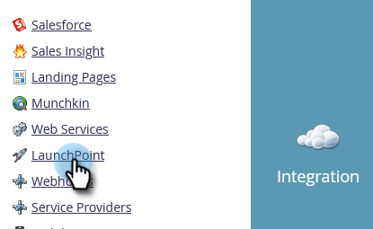
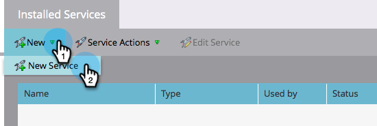
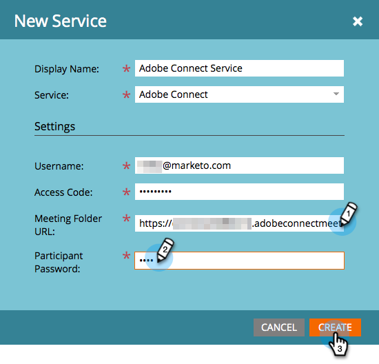

# Hinzufügen von Adobe Connect as a [!DNL LaunchPoint] Service {#add-adobe-connect-as-a-launchpoint-service}

Marketo verwaltet die Registrierung und Teilnahme an Adobe Connect-Webinaren.

>[!NOTE]
>
>**Admin-Berechtigungen erforderlich**

>[!NOTE]
>
>Für diesen Schritt sind ein bestehendes Abonnement von Adobe Connect und Administratorrechte erforderlich. Halten Sie die folgenden Einstellungen bereit: Benutzername, Kennwort, Teilnehmerkennwort und Besprechungsordner-URL.

>[!NOTE]
>
>Adobe Connect On Site wird derzeit nicht unterstützt.

1. Navigieren Sie zum Bereich **[!UICONTROL Admin]**.

   

1. Klicken Sie **[!UICONTROL LaunchPoint]**.

   

1. Klicken Sie auf **[!UICONTROL Neu]** und wählen Sie **[!UICONTROL Neuer Service]**.

   

1. Geben Sie einen **[!UICONTROL Anzeigenamen]** ein. Wählen **[!UICONTROL unter &quot;]**&quot; die Option &quot;Adobe Connect&quot;.

   

1. Geben Sie **[!UICONTROL Benutzernamen]** und **[!UICONTROL Zugriffscode]** ein.

   

1. Schließen Sie den Vorgang ab, indem Sie Ihre **[!UICONTROL Besprechungsordner-]** und **[!UICONTROL Teilnehmerkennwort]** eingeben und dann auf **[!UICONTROL Erstellen]** klicken.

   

   >[!TIP]
   >
   >Wenn Sie das Teilnehmerkennwort erstellen, wird der ausgewählte Wert in eine Abfragezeichenfolge aufgenommen, wenn die Links für das Ereignis gesendet werden. Daher empfehlen wir Ihnen, es kundenfreundlich zu gestalten.

   >[!NOTE]
   >
   >Nachdem Sie sich bei Ihrem Adobe Connect-Konto angemeldet haben, wählen Sie die Registerkarte **[!UICONTROL Seminare]** aus. Kopieren Sie ohne ein Drilldown in ein bestimmtes Seminar die URL aus Ihrer Browser-Leiste in die Einstellung **[!UICONTROL Besprechungsordner-URL]**.

Ihr Adobe Connect-Service ist jetzt mit Marketo synchronisiert!

>[!MORELIKETHIS]
>
>Erfahren Sie, wie [ein Ereignis mit Adobe Connect erstellen](/help/marketo/product-docs/demand-generation/events/create-an-event/create-an-event-with-adobe-connect.md){target="_blank"}.
