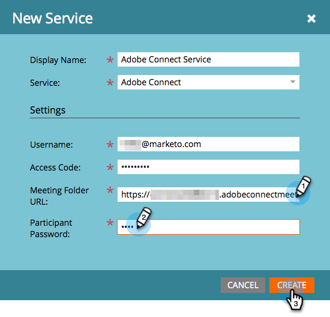

# Hinzufügen von Adobe Connect als [!DNL LaunchPoint]-Dienst {#add-adobe-connect-as-a-launchpoint-service}

Marketo verwaltet die Registrierung und Teilnahme Ihres Adobe Connect-Webinars.

>[!NOTE]
>
>**Erforderliche Administratorberechtigungen**

>[!NOTE]
>
>Für diesen Schritt sind ein bestehendes Abonnement für Adobe Connect und Administratorrechte erforderlich. Verwenden Sie die folgenden Einstellungen: Benutzername, Kennwort, Teilnehmerkennwort und Sitzungsordner-URL.

>[!NOTE]
>
>Adobe Connect On Site wird derzeit nicht unterstützt.

1. Wechseln Sie zum Bereich **[!UICONTROL Admin]** .

   

1. Klicken Sie auf **[!UICONTROL LaunchPoint]**.

   

1. Klicken Sie auf die Dropdownliste **[!UICONTROL Neu]** und wählen Sie **[!UICONTROL Neuer Dienst]** aus.

   

1. Geben Sie einen **[!UICONTROL Anzeigenamen]** ein. Wählen Sie unter &quot;**[!UICONTROL Dienst]**&quot;Adobe Connect aus.

   

1. Geben Sie Ihren **[!UICONTROL Benutzernamen]** und den **[!UICONTROL Zugriffscode]** ein.

   

1. Schließen Sie den Prozess ab, indem Sie Ihre **[!UICONTROL Sitzungsordner-URL]** und Ihr **[!UICONTROL Teilnehmerkennwort]** eingeben und dann auf **[!UICONTROL Erstellen]** klicken.

   

   >[!TIP]
   >
   >Wenn Sie das Teilnehmerkennwort erstellen, wird der von Ihnen ausgewählte Wert in eine Abfragezeichenfolge eingefügt, wenn die Links für das Ereignis gesendet werden. Wir empfehlen Ihnen also, es benutzerfreundlich zu gestalten.

   >[!NOTE]
   >
   >Nachdem Sie sich bei Ihrem Adobe Connect-Konto angemeldet haben, wählen Sie die Registerkarte **[!UICONTROL Seminare]** aus. Kopieren Sie die URL aus Ihrer Browser-Leiste in die Einstellung **[!UICONTROL Sitzungsordner-URL]** , ohne in ein bestimmtes Seminar weitergeleitet zu werden.

Ihr Adobe Connect-Dienst ist jetzt mit Marketo synchronisiert!

>[!MORELIKETHIS]
>
>Erfahren Sie, wie Sie mit Adobe Connect](/help/marketo/product-docs/demand-generation/events/create-an-event/create-an-event-with-adobe-connect.md){target="_blank"} ein Ereignis erstellen.[
