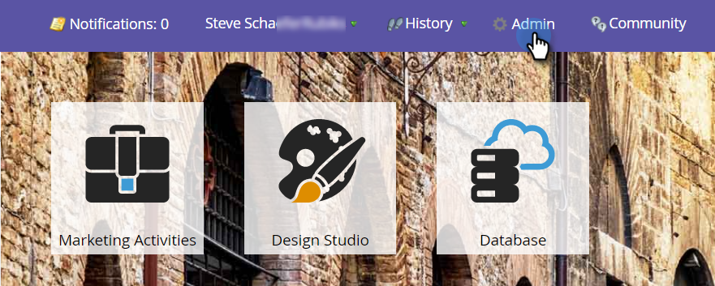

# hinzufügen von Google AdWords als Startpunktdienst mit einem Managerkonto {#add-google-adwords-as-a-launchpoint-service-with-a-manager-account}

Verknüpfen Sie Ihr Google AdWords-Konto mit Marketo, um automatisch Offline-Konversionsdaten von Marketing zu Google AdWords hochzuladen. In der Benutzeroberfläche von AdWords können Sie dann einfach sehen, welche Klicks zu qualifizierten Interessenten, Chancen und neuen Kunden (oder welchen Umsatzstufen Sie verfolgen möchten) führten, nachdem Sie [benutzerdefinierte Spalten](https://support.google.com/adwords/answer/3073556) in AdWords hinzugefügt haben. Diese Informationen werden nicht in der Benutzeroberfläche von Marketo angezeigt.

Wenn Sie über mehrere Google Adwords-Konten verfügen, können Sie ein [Google AdWords Manager-Konto](https://www.google.com/adwords/manager-accounts/) (früher &quot;Mein Client-Center&quot;genannt) verwenden, um diese in Marketing zu integrieren.

Erfahren Sie mehr über die Google Offline-Konversions-Importfunktion[.](https://support.google.com/adwords/answer/2998031?hl=en)

>[!NOTE]
>
>**Administratorberechtigungen erforderlich**

>[!NOTE]
>
>Sie können auch ein [eigenständiges Google AdWords-Konto als Launchpoint-Dienst](add-google-adwords-as-a-launchpoint-service.md) integrieren.

1. Gehen Sie zum Abschnitt **Admin**.

   

1. Wählen Sie **LaunchPoint**.

   

1. Wählen Sie **Neu** und **Neuer Dienst**.

   

1. Geben Sie einen Anzeigenamen ein und wählen Sie **Google AdWords**.

   

1. Wählen Sie **Marketo autorisieren**.

   >[!NOTE]
   >
   >Achten Sie darauf, sich von Ihrem persönlichen Gmail-Konto abzumelden und Pop-ups zu aktivieren.

   

1. Wählen Sie Ihr Konto, das **Google AdWords** zugeordnet ist.

   

1. Wählen Sie **Accept**.

   

1. Der Status wird als **Erfolg** angezeigt. Wählen Sie **Weiter**.

   

1. Laden Sie Ihre Offline-Konvertierungen von Marketing zu Google AdWords hoch **Wöchentlich **oder **Täglich**.

   

1. Attributkonvertierung auf **Erster Klick** oder **Letzter Klick**.

   | Typ | Definition |
   |---|---|
   | Erster Klick | Offline-Konversionen werden den ersten AdWords zugeordnet, auf die eine Person in den letzten 90 Tagen geklickt hat |
   | Letzter Klick | Offline-Konversionen werden den letzten AdWords-Anzeigen zugeordnet, auf die eine Person geklickt hat |

   

   >[!NOTE]
   >
   >[Damit diese Funktion funktioniert, muss die automatische ](https://support.google.com/adwords/answer/1752125?hl=en) Taggingoption aktiviert sein. Es muss in AdWords aktiviert werden.

1. Klicken Sie auf **Weiter**.

   

1. Deaktivieren Sie Konten, die nicht aktualisiert werden sollen. Klicken Sie auf **Erstellen**.

   

   Yippee! Sehen Sie sich jetzt den entsprechenden Artikel an, in dem Sie erfahren, wie Sie AdWords-Offlinekonversionen in Ihrem Umsatzmodell zuordnen.

   >[!NOTE]
   >
   >**Verwandte Artikel**
   >
   >    
   >    
   >    * [Google AdWords-Konversionen im Umsatzmodell mit einem Manager-Konto festlegen](../../../product-docs/reporting/revenue-cycle-analytics/revenue-cycle-models/set-google-adwords-conversions-in-the-revenue-model-with-a-manager-account.md)

