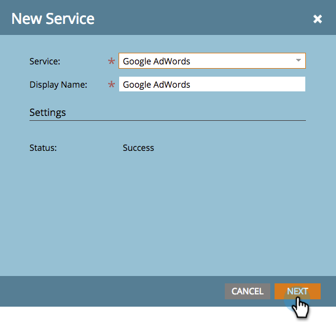

# Hinzufügen von [!DNL Google AdWords] as a [!DNL Launchpoint] Service mit einem Manager-Konto {#add-google-adwords-as-a-launchpoint-service-with-a-manager-account}

Verknüpfen Sie Ihr [!DNL Google AdWords] mit Marketo, um Offline-Konversionsdaten automatisch von Marketo in [!DNL Google AdWords] hochzuladen. In der [!DNL AdWords]-Benutzeroberfläche können Sie dann leicht erkennen, welche Klicks zu qualifizierten Leads, Chancen und neuen Kunden geführt haben (oder welche Umsatzphasen Sie verfolgen möchten), nachdem Sie [benutzerdefinierte Spalten hinzufügen](https://support.google.com/adwords/answer/3073556){target="_blank"} in [!DNL AdWords] hinzugefügt haben. Diese Informationen werden nicht in der Marketo-Benutzeroberfläche angezeigt.

Wenn Sie über mehrere [!DNL Google Adwords]-Konten verfügen, können Sie diese mit einer [[!DNL Google AdWords Manager Account]](https://www.google.com/adwords/manager-accounts/){target="_blank"} (früher als [!DNL My Client Center] bezeichnet) in Marketo integrieren.

Google Erfahren Sie mehr über die Offline-Konversions-Importfunktion von [&#128279;](https://support.google.com/adwords/answer/2998031?hl=en){target="_blank"}.

>[!AVAILABILITY]
>
>Nicht alle Marketo Engage-Benutzer haben diese Funktion erworben. Weitere Informationen erhalten Sie beim Adobe Account Team (Ihrem Account Manager).

>[!NOTE]
>
>**Administratorberechtigungen erforderlich**

>[!NOTE]
>
>Sie können auch ein [Standalone-Konto [!DNL Google AdWords]  als  [!DNL Launchpoint] -Service &#x200B;](/help/marketo/product-docs/administration/additional-integrations/add-google-adwords-as-a-launchpoint-service.md){target="_blank"}.

1. Navigieren Sie zum Bereich **[!UICONTROL Admin]**.

   

1. Wählen Sie **[!UICONTROL LaunchPoint]** aus.

   

1. Klicken Sie auf **[!UICONTROL Neu]** und wählen Sie **[!UICONTROL Neuer Service]**.

   

1. Geben Sie einen **[!UICONTROL Anzeigenamen]** ein und wählen Sie **[!UICONTROL Google AdWords]**.

   

1. Wählen Sie **[!UICONTROL Marketo autorisieren]** aus.

   >[!NOTE]
   >
   >Achten Sie darauf, sich von Ihrem persönlichen [!DNL Gmail]-Konto abzumelden und Popups zu aktivieren.

   

1. Wählen Sie Ihr Konto aus, das mit **[!DNL Google AdWords]** verknüpft ist.

   

1. Klicken Sie **[!UICONTROL Akzeptieren]**.

   

1. Der Status wird als &quot;**[!UICONTROL &quot;]**. Klicken Sie auf **[!UICONTROL Weiter]**.

   

1. Laden Sie Ihre Offline-Konversionen von Marketo in [!DNL Google AdWords] **[!UICONTROL wöchentlich]** oder **[!UICONTROL täglich]** hoch.

   

1. Attributkonvertierung in „Erster **[!UICONTROL &quot;]** &quot;**[!UICONTROL letzten]**&quot;.

   

   | Typ | Definition |
   |---|---|
   | [!UICONTROL Erster Klick] | Offline-Konversionen werden der ersten [!DNL AdWords]-Anzeige zugeordnet, auf die eine Person in den letzten 90 Tagen geklickt hat |
   | [!UICONTROL Letzter Klick] | Offline-Konversionen werden der letzten [!DNL AdWords] zugeordnet, auf die eine Person geklickt hat |

   >[!NOTE]
   >
   >[Automatisches Tagging](https://support.google.com/adwords/answer/1752125?hl=en){target="_blank"} muss ausgewählt sein, damit diese Funktion funktioniert. Sie muss in [!DNL AdWords] aktiviert werden.

1. Klicken Sie auf **[!UICONTROL Weiter]**.

   

1. Auswahl der Konten aufheben, die nicht aktualisiert werden sollen. Klicken Sie auf **[!UICONTROL Erstellen]**.

   

   Im folgenden verwandten Artikel erfahren Sie, wie Sie [!DNL AdWords] Offline-Konversionen in Ihrem Umsatzmodell zuordnen.

   >[!MORELIKETHIS]
   >
   >[Set [!DNL Google AdWords] Conversions im Umsatzmodell mit einem Manager-Konto](/help/marketo/product-docs/reporting/revenue-cycle-analytics/revenue-cycle-models/set-google-adwords-conversions-in-the-revenue-model-with-a-manager-account.md){target="_blank"}
