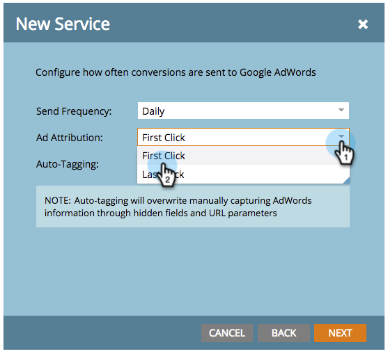

# Hinzufügen von Google AdWords als Startpunktdienst mit einem Manager-Konto {#add-google-adwords-as-a-launchpoint-service-with-a-manager-account}

Verknüpfen Sie Ihr Google AdWords-Konto mit Marketo, um Offline-Konversionsdaten automatisch von Marketo in Google AdWords hochzuladen. Anschließend können Sie in der AdWords-Benutzeroberfläche einfach sehen, welche Klicks zu qualifizierten Leads, Chancen und neuen Kunden (oder welchen Umsatzstufen Sie verfolgen möchten) geführt haben, nachdem Sie  [Benutzerdefinierte Spalten hinzufügen](https://support.google.com/adwords/answer/3073556){target=&quot;_blank&quot;} in AdWords. Diese Informationen werden nicht in der Benutzeroberfläche von Marketo angezeigt.

Wenn Sie über mehrere Google Adwords -Konten verfügen, können Sie eine [Google AdWords Manager-Konto](https://www.google.com/adwords/manager-accounts/){target=&quot;_blank&quot;} (ehemals &quot;My Client Center&quot;) zur Integration in Marketo.

Weitere Informationen [Google-Funktion zum Offline-Konversionsimport](https://support.google.com/adwords/answer/2998031?hl=en){target=&quot;_blank&quot;}.

>[!AVAILABILITY]
>
>Nicht alle Kunden haben diese Funktion erworben. Weitere Informationen erhalten Sie von Ihrem Customer Success Manager.

>[!NOTE]
>
>**Erforderliche Administratorberechtigungen**

>[!NOTE]
>
>Sie können auch eine [eigenständiges Google AdWords-Konto als Startpunktdienst](/help/marketo/product-docs/administration/additional-integrations/add-google-adwords-as-a-launchpoint-service.md){target=&quot;_blank&quot;}.

1. Navigieren Sie zu **Admin** Abschnitt.

   

1. Auswählen **LaunchPoint**.

   

1. Klicken Sie auf **Neu** und wählen Sie **Neuer Dienst**.

   

1. Geben Sie einen Anzeigenamen ein und wählen Sie **Google AdWords**.

   

1. Auswählen **Marketo autorisieren**.

   >[!NOTE]
   >
   >Melden Sie sich bei Ihrem persönlichen Gmail-Konto ab und aktivieren Sie Pop-ups.

   

1. Wählen Sie Ihr Konto aus, das mit **Google AdWords**.

   

1. Klicken **Accept**.

   

1. Status wird als **Erfolg**. Auswählen **Nächste**.

   

1. Hochladen Ihrer Offline-Konversionen von Marketo in Google AdWords **Wöchentlich** oder **Täglich**.

   

1. Attributkonvertierung in **Erster Klick** oder **Letzter Klick**.

   

   | Typ | Definition |
   |---|---|
   | Erster Klick | Offline-Konversionen werden den ersten AdWords zugeordnet, auf die eine Person in den letzten 90 Tagen geklickt hat. |
   | Letzter Klick | Offline-Konversionen werden den letzten AdWords zugeordnet, auf die eine Person geklickt hat. |

   >[!NOTE]
   >
   >[Automatisches Tagging](https://support.google.com/adwords/answer/1752125?hl=en){target=&quot;_blank&quot;} muss ausgewählt sein, damit diese Funktion funktioniert. Sie muss in AdWords aktiviert werden.

1. Klicken **Nächste**.

   

1. Deaktivieren Sie die Konten, die Sie nicht aktualisieren möchten. Klicken Sie auf **Erstellen**.

   

   Im folgenden Artikel erfahren Sie, wie Sie Offline-Konversionen von AdWords in Ihrem Umsatzmodell zuordnen.

   >[!MORELIKETHIS]
   >
   >[Festlegen von Google AdWords-Konversionen im Umsatzmodell mit einem Manager-Konto](/help/marketo/product-docs/reporting/revenue-cycle-analytics/revenue-cycle-models/set-google-adwords-conversions-in-the-revenue-model-with-a-manager-account.md){target=&quot;_blank&quot;}
