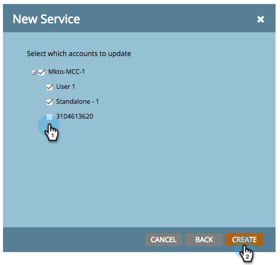

# Hinzufügen [!DNL Google AdWords] as a [!DNL Launchpoint] Dienst mit einem Manager-Konto {#add-google-adwords-as-a-launchpoint-service-with-a-manager-account}

Verknüpfen [!DNL Google AdWords] Konto zu Marketo zum automatischen Hochladen von Offline-Konversionsdaten von Marketo in [!DNL Google AdWords]. Dann aus dem [!DNL AdWords] -Benutzeroberfläche können Sie einfach erkennen, welche Klicks zu qualifizierten Leads, Chancen und neuen Kunden (oder welchen Umsatzstufen Sie verfolgen möchten) geführt haben, nachdem Sie  [Benutzerdefinierte Spalten hinzufügen](https://support.google.com/adwords/answer/3073556){target="_blank"} in [!DNL AdWords]. Diese Informationen werden nicht in der Benutzeroberfläche von Marketo angezeigt.

Wenn Sie mehrere [!DNL Google Adwords] Konten können Sie eine [[!DNL Google AdWords Manager Account]](https://www.google.com/adwords/manager-accounts/){target="_blank"} (früher bekannt als [!DNL My Client Center]), um sie in Marketo zu integrieren.

Weitere Informationen [Google-Funktion für den Offline-Konversionsimport](https://support.google.com/adwords/answer/2998031?hl=en){target="_blank"}.

>[!AVAILABILITY]
>
>Nicht alle Marketo Engage-Benutzer haben diese Funktion erworben. Weitere Informationen erhalten Sie vom Adobe Account Team (Ihrem Kundenbetreuer).

>[!NOTE]
>
>**Erforderliche Administratorberechtigungen**

>[!NOTE]
>
>Sie können auch eine [eigenständig [!DNL Google AdWords] als [!DNL Launchpoint] service](/help/marketo/product-docs/administration/additional-integrations/add-google-adwords-as-a-launchpoint-service.md){target="_blank"}.

1. Navigieren Sie zum **[!UICONTROL Admin]**-Bereich.

   

1. Auswählen **[!UICONTROL LaunchPoint]**.

   

1. Klicken Sie auf **[!UICONTROL Neu]** und wählen Sie **[!UICONTROL Neuer Dienst]**.

   

1. Geben Sie einen **[!UICONTROL Anzeigename]** und wählen **[!UICONTROL Google AdWords]**.

   

1. Auswählen **[!UICONTROL Marketo autorisieren]**.

   >[!NOTE]
   >
   >Stellen Sie sicher, dass Sie sich von Ihrem persönlichen [!DNL Gmail] und aktivieren Sie Popups.

   

1. Wählen Sie Ihr Konto aus, das mit **[!DNL Google AdWords]**.

   

1. Klicks **[!UICONTROL Accept]**.

   

1. Der Status wird als **[!UICONTROL Erfolg]**. Auswählen **[!UICONTROL Nächste]**.

   

1. Hochladen der Offline-Konvertierungen von Marketo in [!DNL Google AdWords] **[!UICONTROL Wöchentlich]** oder **[!UICONTROL Täglich]**.

   

1. Attributkonvertierung in **[!UICONTROL Erster Klick]** oder **[!UICONTROL Letzter Klick]**.

   

   | Typ | Definition |
   |---|---|
   | [!UICONTROL Erster Klick] | Offline-Konversionen werden der ersten [!DNL AdWords] und dass eine Person in den letzten 90 Tagen geklickt hat |
   | [!UICONTROL Letzter Klick] | Offline-Konversionen werden der letzten [!DNL AdWords] und dass eine Person geklickt hat |

   >[!NOTE]
   >
   >[Automatisches Tagging](https://support.google.com/adwords/answer/1752125?hl=en){target="_blank"} muss ausgewählt sein, damit diese Funktion funktioniert. Sie muss in [!DNL AdWords].

1. Klicken Sie auf **[!UICONTROL Weiter]**.

   

1. Deaktivieren Sie die Konten, die Sie nicht aktualisieren möchten. Klicken Sie auf **[!UICONTROL Erstellen]**.

   

   Informationen zur Zuordnung finden Sie jetzt im entsprechenden Artikel unten [!DNL AdWords] Offline-Konversionen in Ihrem Umsatzmodell.

   >[!MORELIKETHIS]
   >
   >[Satz [!DNL Google AdWords] Konversionen im Umsatzmodell mit einem Manager-Konto](/help/marketo/product-docs/reporting/revenue-cycle-analytics/revenue-cycle-models/set-google-adwords-conversions-in-the-revenue-model-with-a-manager-account.md){target="_blank"}
