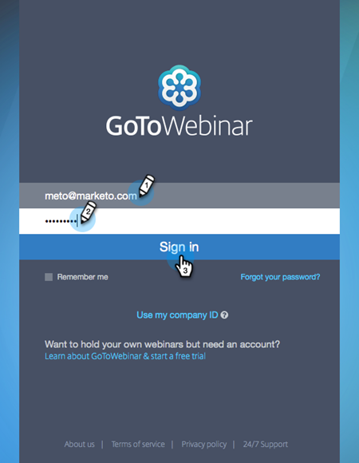

# Hinzufügen von [!DNL GoToWebinar] als [!DNL LaunchPoint]-Dienst {#add-gotowebinar-as-a-launchpoint-service}

Marketo verwaltet Ihre [!DNL GoToWebinar] -Registrierung und -Teilnahme.

>[!NOTE]
>
>**Erforderliche Administratorberechtigungen**

>[!NOTE]
>
>Für diesen Schritt sind ein bestehendes Abonnement für [!DNL GoToWebinar] und Administratorrechte erforderlich. Halten Sie die E-Mail-Adresse und das Passwort, mit denen Sie sich bei [!DNL GoToWebinar] anmelden, zur Hand.

>[!NOTE]
>
>[!DNL GoToMeeting], [!DNL GoToWebcast] und [!DNL GoToTraining] werden derzeit nicht unterstützt.

1. Wechseln Sie zum Bereich **[!UICONTROL Admin]** .

   

1. Klicken Sie auf **[!UICONTROL LaunchPoint]**.

   

1. Wählen Sie **[!UICONTROL Neu]** und **[!UICONTROL Neuer Dienst]** aus.

   

1. Geben Sie einen **[!UICONTROL Anzeigenamen]** ein. Wählen Sie unter **[!UICONTROL Service]** die Option **[!UICONTROL GoToWebinar]**.

   

1. Klicken Sie auf **[!UICONTROL Anmelden bei GoToWebinar]**.

   

   >[!NOTE]
   >
   >Wenn Sie Firmenname und Auftragstitel aus Ihrem Marketo-Formular mit [!DNL GoToWebinar] synchronisieren möchten, wählen Sie das Feld **[!UICONTROL Zusätzliche Felder aktivieren]** aus.

1. Geben Sie im Popup-Fenster [!DNL GoToWebinar] Anmelden Ihre E-Mail-Adresse und Ihr Kennwort für **[!UICONTROL GoToWebinar]** ein und klicken Sie auf **[!UICONTROL Anmelden]**.

   

1. Nachdem das Fenster geschlossen wurde, klicken Sie auf **[!UICONTROL Erstellen]**.

   

1. Sehr gut! Ihr **[!UICONTROL GoToWebinar]**-Konto wird jetzt mit Marketo synchronisiert.

   

>[!CAUTION]
>
>Wenn Sie Ihr Kennwort in [!DNL GoToWebinar] aktualisieren, müssen Sie auch Ihr Kennwort in Marketo aktualisieren.

>[!MORELIKETHIS]
>
>Erfahren Sie, wie Sie mit  [!DNL GotoWebinar]](/help/marketo/product-docs/demand-generation/events/create-an-event/create-an-event-with-gotowebinar.md){target="_blank"} ein Ereignis erstellen.[
