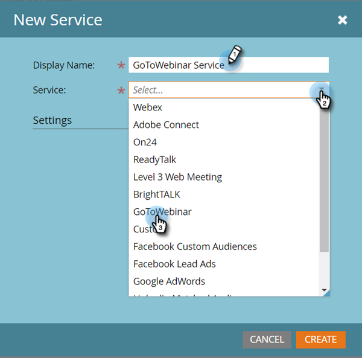

# Hinzufügen von [!DNL GoToWebinar] as a [!DNL LaunchPoint] Service {#add-gotowebinar-as-a-launchpoint-service}

Marketo verwaltet die Registrierung und die Teilnahme an [!DNL GoToWebinar].

>[!NOTE]
>
>**Admin-Berechtigungen erforderlich**

>[!NOTE]
>
>Für diesen Schritt ist ein vorhandenes Abonnement von [!DNL GoToWebinar]- und Administratorrechten erforderlich. Halten Sie die E-Mail-Adresse und das Passwort bereit, mit denen Sie sich bei [!DNL GoToWebinar] anmelden.

>[!NOTE]
>
>[!DNL GoToMeeting], [!DNL GoToWebcast], and [!DNL GoToTraining] are not currently supported.

1. Navigieren Sie zum Bereich **[!UICONTROL Admin]**.

   

1. Klicken Sie **[!UICONTROL LaunchPoint]**.

   

1. Wählen Sie **[!UICONTROL Neu]** und **[!UICONTROL Neuer Service]** aus.

   

1. Geben Sie einen **[!UICONTROL Anzeigenamen]** ein. Wählen **[!UICONTROL unter]** die Option **[!UICONTROL GoToWebinar]** aus.

   

1. Klicken Sie **[!UICONTROL Bei GoToWebinar anmelden]**.

   

   >[!NOTE]
   >
   >Wenn Sie den Firmennamen und die Stellenbezeichnung aus Ihrem Marketo-Formular mit [!DNL GoToWebinar] synchronisieren möchten, aktivieren Sie das **[!UICONTROL Zusätzliche Felder aktivieren]**.

1. Geben Sie im Pop-up-Fenster &quot;[!DNL GoToWebinar] Anmelden“ Ihre **[!UICONTROL GoToWebinar]** E-Mail und Ihr Passwort ein und klicken Sie auf **[!UICONTROL Anmelden]**.

   

1. Klicken Sie nach dem Schließen des Fensters auf **[!UICONTROL Erstellen]**.

   

1. Ihr **[!UICONTROL GoToWebinar]**-Konto ist jetzt mit Marketo synchronisiert.

   

>[!CAUTION]
>
>Wenn Sie Ihr Kennwort in [!DNL GoToWebinar] aktualisieren, müssen Sie auch Ihr Kennwort in Marketo aktualisieren.

>[!MORELIKETHIS]
>
>Erfahren Sie, wie Sie [ein Ereignis mit erstellen [!DNL GotoWebinar]](/help/marketo/product-docs/demand-generation/events/create-an-event/create-an-event-with-gotowebinar.md){target="_blank"}.
