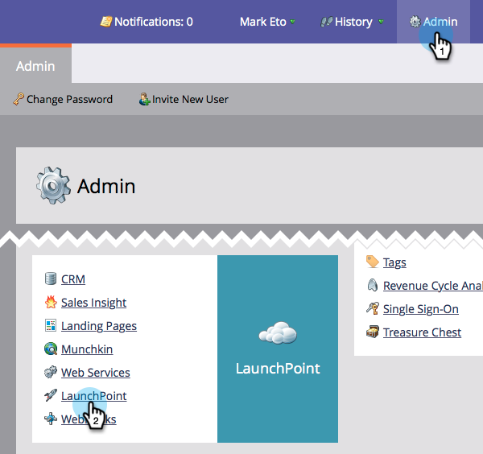
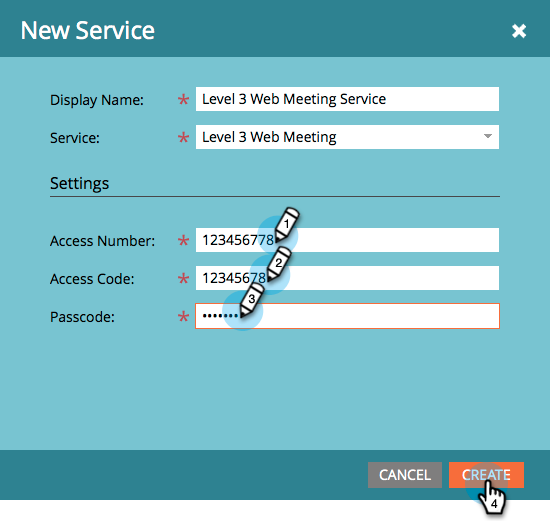

# hinzufügen Level 3 Web Meeting als LaunchPoint Service {#add-level-web-meeting-as-a-launchpoint-service}

Marketo verwaltet die Registrierung und Teilnahme an einem Level 3 Web Meeting.

>[!NOTE]
>
>**Administratorberechtigungen erforderlich**

>[!NOTE]
>
>Für diesen Schritt sind ein Abonnement zu Level 3 Web Meeting und Verwaltungsrechte erforderlich. Halten Sie Ihre Zugangsnummer, Ihren Zugangscode und Ihren Passcode bereit.

1. Gehen Sie zu **Admin** und wählen Sie **LaunchPoint**.

   

1. Wählen Sie **Neu** und dann **Neuer Dienst**.

   

1. Geben Sie einen **Anzeigenamen** ein. Wählen Sie unter **Service** **Level 3 Web Meeting**.

   

1. Geben Sie **Zugriffsnummer**, **Zugangscode** und **Passcode** ein und klicken Sie dann auf **Erstellen**.

   

Ihr Level 3 Web Meeting-Konto ist jetzt mit Marketo synchronisiert!

>[!MORELIKETHIS]
>
>Erfahren Sie, wie Sie ein Ereignis mit einem Level-3-Webtreffen [erstellen.](/help/marketo/product-docs/demand-generation/events/create-an-event/create-an-event-with-level-3-web-meeting.md)
