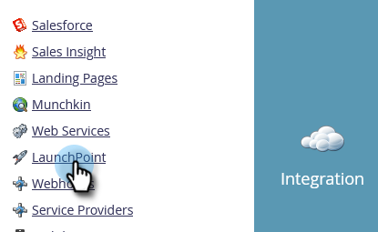

# Hinzufügen von [!DNL Level 3 Web Meeting] as a [!DNL LaunchPoint] Service {#add-level-three-web-meeting-as-a-launchpoint-service}

Marketo verwaltet die Registrierung und die Teilnahme an [!DNL Level 3 Web Meeting].

>[!NOTE]
>
>**Administratorberechtigungen erforderlich**

>[!NOTE]
>
>Für diesen Schritt ist ein vorhandenes Abonnement von [!DNL Level 3 Web Meeting]- und Administratorrechten erforderlich. Halten Sie Ihre Zugriffsnummer, Ihren Zugriffscode und Ihren Passcode bereit.

1. Navigieren Sie zum Bereich **[!UICONTROL Admin]**.

   

1. Klicken Sie **[!UICONTROL LaunchPoint]**.

   

1. Wählen Sie **[!UICONTROL Neu]** und dann **[!UICONTROL Neuer Service]** aus.

   

1. Geben Sie einen **[!UICONTROL Anzeigenamen]** ein. Wählen Sie **[!UICONTROL Service]** die Option **[!UICONTROL Stufe 3-Webtreffen]**.

   

1. Geben Sie Ihre **[!UICONTROL Zugriffsnummer]**, **[!UICONTROL Zugriffscode]** und **[!UICONTROL Passcode]** ein und klicken Sie dann auf **[!UICONTROL Erstellen]**.

   

Ihr [!DNL Level 3 Web Meeting]-Konto ist jetzt mit Marketo synchronisiert!

>[!MORELIKETHIS]
>
>Erfahren Sie, wie Sie [ein Ereignis mit einer  [!DNL Level 3 Web Meeting]](/help/marketo/product-docs/demand-generation/events/create-an-event/create-an-event-with-level-3-web-meeting.md){target="_blank"} erstellen.
