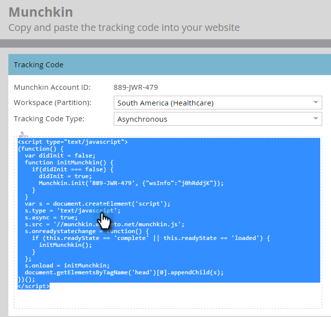

# hinzufügen Munchkin-Rückverfolgungscode auf Ihrer Website {#add-munchkin-tracking-code-to-your-website}

Marketos benutzerdefinierter JavaScript-Rückverfolgungscode namens Munchkin verfolgt alle Personen, die Ihre Website besuchen, sodass Sie auf ihre Besuche mit automatisierten Marketing-Kampagnen reagieren können. Auch anonyme Besucher werden zusammen mit ihren IP-Adressen und anderen Informationen verfolgt. ** Ohne diesen Rückverfolgungscode können Sie Besuche oder andere Aktivitäten auf Ihrer Website nicht verfolgen!**

>[!NOTE]
>
>**Voraussetzungen**
>
>Stellen Sie sicher, dass Sie Zugriff auf einen erfahrenen JavaScript-Entwickler haben. Der technische Support von Marketo ist nicht so eingerichtet, dass er bei der Fehlerbehebung für benutzerdefiniertes JavaScript hilft.

## hinzufügen des Rückverfolgungscodes auf Ihrer Website {#add-tracking-code-to-your-website}

>[!NOTE]
>
>Adobe Experience Cloud-Kunden können auch die Integration von Marketo in Adobe Launch verwenden, um Munchkin-Skripten auf ihren Webseiten einzubinden. Holen Sie sich die App [hier](https://www.adobeexchange.com/experiencecloud.details.101054.html).

1. Gehen Sie zu **Admin** und klicken Sie im Baum links auf **Munchkin** .

   

   Wählen Sie Asynchron für den Rückverfolgungscode-Typ.

   

   >[!NOTE]
   >
   >In fast allen Fällen sollten Sie den asynchronen Code verwenden. [Weitere Informationen.](#types-of-munchkin-tracking-codes)

   Klicken Sie auf und kopieren Sie den Javascript-Trackingcode, den Sie auf Ihre Website setzen möchten.

   

   >[!CAUTION]
   >
   >Verwenden Sie nicht den Code, der in diesem Screenshot gezeigt wird - Sie müssen den eindeutigen Code verwenden, der in Ihrem Konto angezeigt wird!

   >[!TIP]
   >
   >Setzen Sie Trackingcode auf die Webseiten, die Sie verfolgen möchten. Dies kann jede Seite für kleinere Sites oder nur wichtige Seiten auf Sites mit vielen dynamisch generierten Webseiten, Benutzerforen usw. sein.

   Die besten Ergebnisse erzielen Sie, wenn Sie den asynchronen Munchkin-Code verwenden und ihn in die `<head>` Elemente Ihrer Seiten einfügen. Wenn Sie den einfachen Code verwenden (nicht empfohlen), liegt dieser direkt vor dem `</body>` Tag.
   

>[!TIP]
>
>Bei Sites mit hohem Traffic-Aufkommen (d. h. Hunderttausenden Besuchen pro Monat) empfehlen wir, anonyme Personen nicht zu verfolgen. [Weitere Informationen.](http://developers.marketo.com/documentation/websites/lead-tracking-munchkin-js/)

## Rückverfolgungscode bei Verwendung mehrerer Arbeitsflächen Hinzufügen {#add-tracking-code-when-using-multiple-workspaces}

Wenn Sie Workspaces in Ihrem Marketo-Konto verwenden, haben Sie wahrscheinlich auch separate Webpräsenzen, die Ihren Arbeitsbereichen entsprechen. In diesem Fall können Sie das Munchkin-Tracking-Javascript verwenden, um Ihre anonymen Personen der richtigen Arbeitsfläche und Partition zuzuweisen.

1. Gehen Sie zu Admin und klicken Sie im Baum auf der linken Seite auf Munchkin.

1. Wählen Sie den entsprechenden Arbeitsbereich für die Webseiten aus, die Sie verfolgen möchten.

>[!NOTE]
>
>Wenn Sie den speziellen Workspace-Munchkin-Code nicht verwenden, werden die Personen der Standardpartition zugewiesen, die beim Einrichten Ihres Kontos erstellt wurde. Es heißt anfangs &quot;Standard&quot;, aber Sie haben dies möglicherweise in Ihrem eigenen Marketo-Konto geändert.

1. Wählen Sie Asynchron für den Rückverfolgungscode-Typ.

   

1. Klicken Sie auf und kopieren Sie den JavaScript-Rückverfolgungscode, der auf Ihre Website eingefügt werden soll.

>[!CAUTION]
>
>Verwenden Sie nicht den Code, der in diesem Screenshot gezeigt wird - Sie müssen den eindeutigen Code verwenden, der in Ihrem Konto angezeigt wird!

1. Platzieren Sie den Rückverfolgungscode auf Ihren Webseiten im `<head>` Element. Neue Personen, die diese Seite besuchen, werden dieser Partition zugewiesen.

>[!CAUTION]
>
>Sie können nur ein Munchkin-Verfolgungsskript für eine einzelne Partition und einen Arbeitsbereich auf einer Seite verwenden. Schließen Sie keine Verfolgungsskripten für mehrere Partitionen/Arbeitsbereiche auf Ihrer Website ein.

>[!NOTE]
>
>Landingpages, die in Marketing erstellt wurden, enthalten automatisch Trackingcode, sodass Sie diesen Code nicht darauf verwenden müssen.

## Arten von Munchkin-Rückverfolgungscodes {#types-of-munchkin-tracking-codes}

Es gibt 3 Arten von Munchkin-Trackingcodes, aus denen Sie wählen können. Jede Änderung wirkt sich unterschiedlich auf die Ladezeit der Webseite aus.

1. **Einfach**: hat die wenigsten Codezeilen, optimiert aber nicht für die Ladezeit der Webseite. Dieser Code lädt die jQuery-Bibliothek jedes Mal, wenn eine Webseite geladen wird.
1. **Asynchron**: verkürzt die Ladezeit der Webseite.
1. **Asynchrone jQuery**: verringert die Ladezeit von Webseiten und verbessert auch die Systemleistung. Bei diesem Code wird davon ausgegangen, dass Sie bereits über jQuery verfügen, und nicht überprüft, ob Sie ihn laden möchten.

## Testen Sie, ob Ihr Munchkin-Code funktioniert. {#test-if-your-munchkin-code-is-working}

So überprüfen Sie, ob Ihr Munchkin-Code funktioniert, nachdem Sie ihn hinzugefügt haben:

1. Besuchen Sie Ihre Webseite.
1. Gehen Sie zu **Analytics**.

   

1. Klicken Sie auf **Webseite Aktivität**.

   

1. Klicken Sie auf die Registerkarte **Einstellungen** , klicken Sie bei Dublette auf **Aktivität Source** und ändern Sie sie in **Anonyme Besucher (einschließlich ISPs)**.

   

   

1. Klicken Sie auf die Registerkarte **Bericht** . Wenn keine Daten angezeigt werden, warten Sie einige Minuten und klicken Sie dann auf das Aktualisierungssymbol unten.

