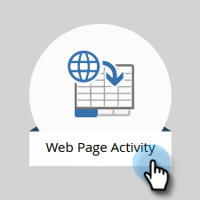

# Fügen Sie [!DNL Munchkin] Trackingcode zu Ihrer Website hinzu. {#add-munchkin-tracking-code-to-your-website}

Der benutzerdefinierte JavaScript-Trackingcode von Marketo namens [!DNL Munchkin] verfolgt alle Personen, die Ihre Website besuchen, sodass Sie mit automatisierten Marketingkampagnen auf ihre Besuche reagieren können. Auch anonyme Besucher werden zusammen mit ihren IP-Adressen und anderen Informationen verfolgt. **Ohne diesen Trackingcode können Sie Besuche oder andere Aktivitäten auf Ihrer Website nicht verfolgen**!

>[!PREREQUISITES]
>
>Stellen Sie sicher, dass Sie Zugriff auf einen erfahrenen JavaScript-Entwickler haben. Der technische Support von Marketo ist nicht so eingerichtet, dass er bei der Fehlerbehebung für benutzerdefinierte JavaScript unterstützt.

## Hinzufügen von Trackingcode zu Ihrer Website {#add-tracking-code-to-your-website}

>[!NOTE]
>
>Adobe Experience Cloud-Benutzer können auch die [Marketo-Integration in Adobe Launch](https://exchange.adobe.com/apps/ec/100223/adobe-launch-core-extension){target="_blank"} verwenden, um das [!DNL Munchkin]-Skript auf ihren Webseiten einzubinden. Wenn Sie Adobe Launch verwenden, wird _das Skript [!DNL Munchkin] automatisch hinzugefügt_, sodass Sie es nicht selbst hinzufügen müssen.

1. Wechseln Sie zum Bereich **[!UICONTROL Admin]** .

   

1. Klicken Sie auf **[!UICONTROL Munchkin]**.

   

1. Wählen Sie **[!UICONTROL Asynchron]** für **[!UICONTROL Trackingcode-Typ]** aus.

   

   >[!NOTE]
   >
   >In fast allen Fällen sollten Sie den asynchronen Code verwenden. [Weitere Informationen](#types-of-munchkin-tracking-codes).

1. Klicken Sie auf den Javascript-Trackingcode und kopieren Sie ihn in Ihre Website.

   

   >[!CAUTION]
   >
   >Verwenden Sie nicht den in diesem Screenshot angezeigten Code - Sie müssen den eindeutigen Code verwenden, der in Ihrem Konto angezeigt wird!

   >[!TIP]
   >
   >Fügen Sie den Trackingcode auf die Webseiten ein, die Sie verfolgen möchten. Dabei kann es sich um jede Seite für kleinere Sites oder nur um wichtige Seiten auf Sites mit vielen dynamisch generierten Webseiten, Benutzerforen usw. handeln.

   Die besten Ergebnisse erzielen Sie, wenn Sie den asynchronen Code [!DNL Munchkin] verwenden und ihn in die Elemente `<head>` Ihrer Seiten einfügen. Wenn Sie den einfachen Code verwenden (nicht empfohlen), liegt dieser direkt vor dem Tag `</body>` .

   

   >[!TIP]
   >
   >Bei Sites mit hohem Traffic-Aufkommen (d. h. Hunderttausende Besuche pro Monat) empfehlen wir, keine anonymen Personen zu verfolgen. [Weitere Informationen](https://experienceleague.adobe.com/en/docs/marketo-developer/marketo/javascriptapi/lead-tracking/){target="_blank"}.

## Hinzufügen von Trackingcode bei Verwendung mehrerer Arbeitsbereiche {#add-tracking-code-when-using-multiple-workspaces}

Wenn Sie Workspace in Ihrem Marketo-Konto verwenden, verfügen Sie wahrscheinlich auch über separate Webpräsenzen, die Ihren Arbeitsbereichen entsprechen. In diesem Fall können Sie das JavaScript [!DNL Munchkin]-Tracking verwenden, um Ihre anonymen Personen dem richtigen Arbeitsbereich und der richtigen Partition zuzuweisen.

1. Wechseln Sie zum Bereich **[!UICONTROL Admin]** .

   

1. Klicken Sie auf **[!UICONTROL Munchkin]**.

   

1. Wählen Sie den entsprechenden Arbeitsbereich für die Webseiten aus, die Sie verfolgen möchten.

   

   >[!NOTE]
   >
   >Wenn Sie den speziellen Workspace [!DNL Munchkin] -Code nicht verwenden, werden die Personen der Standardpartition zugewiesen, die bei der Einrichtung Ihres Kontos erstellt wurde. Er trägt anfangs den Namen &quot;[!UICONTROL Default]&quot;, aber Sie haben dies möglicherweise in Ihrem eigenen Marketo-Konto geändert.

1. Wählen Sie **[!UICONTROL Asynchron]** für **[!UICONTROL Trackingcode-Typ]** aus.

   

1. Klicken Sie auf den JavaScript-Trackingcode und kopieren Sie ihn in Ihre Website.

   

   >[!CAUTION]
   >
   >Verwenden Sie nicht den in diesem Screenshot angezeigten Code - Sie müssen den eindeutigen Code verwenden, der in Ihrem Konto angezeigt wird!

1. den Trackingcode im Element `<head>` auf Ihren Webseiten platzieren. Neue Personen, die diese Seite besuchen, werden dieser Partition zugewiesen.

   

   >[!CAUTION]
   >
   >Sie können nur ein einzelnes [!DNL Munchkin]-Tracking-Skript für eine Partition und einen Arbeitsbereich auf einer Seite verwenden. Schließen Sie keine Tracking-Skripte für mehrere Partitionen/Arbeitsbereiche auf Ihrer Website ein.

   >[!NOTE]
   >
   >In Marketo erstellte Landingpages enthalten automatisch Trackingcode, sodass Sie diesen Code nicht darauf ablegen müssen.

## Typen von [!DNL Munchkin] Trackingcodes {#types-of-munchkin-tracking-codes}

Es gibt drei Typen von [!DNL Munchkin]-Trackingcodes, aus denen Sie wählen können. Jede Änderung wirkt sich unterschiedlich auf die Ladezeiten der Webseite aus.

1. **[!UICONTROL Einfach]**: weist die wenigsten Codezeilen auf, optimiert jedoch nicht für die Ladezeit von Webseiten. Dieser Code lädt die jQuery-Bibliothek jedes Mal, wenn eine Webseite geladen wird.
1. **[!UICONTROL Asynchron]**: verringert die Ladezeit von Webseiten.
1. **[!UICONTROL Asynchrone jQuery]**: reduziert die Ladezeit von Webseiten und verbessert auch die Systemleistung. In diesem Code wird davon ausgegangen, dass Sie bereits über jQuery verfügen und nicht überprüfen, ob Sie ihn laden.

## Testen, ob Ihr [!DNL Munchkin]-Code funktioniert {#test-if-your-munchkin-code-is-working}

So überprüfen Sie, ob Ihr [!DNL Munchkin]-Code funktioniert, nachdem Sie ihn hinzugefügt haben:

1. Besuchen Sie Ihre Webseite.

1. Klicken Sie in Ihrem [!DNL My Marketo] auf die Kachel **[!UICONTROL Analytics]** .

   

1. Klicken Sie auf **[!UICONTROL Web Page Activity]**.

   

1. Klicken Sie auf die Registerkarte **[!UICONTROL Einrichtung]** und doppelklicken Sie auf **[!UICONTROL Aktivitäts-Source]**.

   

1. Ändern Sie die [!UICONTROL Aktivität Source] in **[!UICONTROL Anonyme Besucher (einschließlich ISPs)]** und klicken Sie auf **[!UICONTROL Anwenden]**.

   

1. Klicken Sie auf die Registerkarte **[!UICONTROL Bericht]** .

   

   >[!NOTE]
   >
   >Wenn keine Daten angezeigt werden, warten Sie einige Minuten und klicken Sie auf das Aktualisierungssymbol am unteren Rand.
