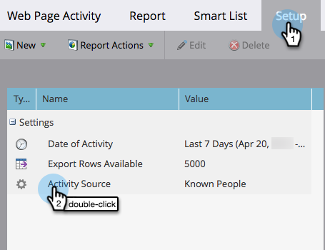

# Hinzufügen [!DNL Munchkin] Trackingcode auf Ihrer Website {#add-munchkin-tracking-code-to-your-website}

Marketos benutzerdefinierter JavaScript-Trackingcode namens [!DNL Munchkin]verfolgt alle Personen auf Ihrer Website, sodass Sie mit automatisierten Marketing-Kampagnen auf ihre Besuche reagieren können. Auch anonyme Besucher werden zusammen mit ihren IP-Adressen und anderen Informationen verfolgt. **Ohne diesen Trackingcode können Sie keine Besuche oder anderen Aktivitäten auf Ihrer Website verfolgen**!

>[!PREREQUISITES]
>
>Stellen Sie sicher, dass Sie Zugriff auf einen erfahrenen JavaScript-Entwickler haben. Der technische Support von Marketo ist nicht für die Fehlerbehebung bei benutzerdefiniertem JavaScript eingerichtet.

## Hinzufügen von Trackingcode zu Ihrer Website {#add-tracking-code-to-your-website}

>[!NOTE]
>
>Adobe Experience Cloud-Benutzer können auch [Marketo-Integration in Adobe Launch](https://exchange.adobe.com/apps/ec/100223/adobe-launch-core-extension){target="_blank"} einschließen [!DNL Munchkin] Skript auf ihren Webseiten. Wenn Sie Adobe Launch verwenden, _die [!DNL Munchkin] Skript automatisch hinzugefügt_, sodass Sie es nicht selbst hinzufügen müssen.

1. Navigieren Sie zu **[!UICONTROL Admin]** Bereich.

   

1. Klicks **[!UICONTROL Munchkin]**.

   

1. Auswählen **[!UICONTROL Asynchron]** für **[!UICONTROL Trackingcode-Typ]**.

   

   >[!NOTE]
   >
   >In fast allen Fällen sollten Sie den asynchronen Code verwenden. [Weitere Infos](#types-of-munchkin-tracking-codes).

1. Klicken Sie auf den Javascript-Trackingcode und kopieren Sie ihn in Ihre Website.

   

   >[!CAUTION]
   >
   >Verwenden Sie nicht den in diesem Screenshot angezeigten Code - Sie müssen den eindeutigen Code verwenden, der in Ihrem Konto angezeigt wird!

   >[!TIP]
   >
   >Fügen Sie den Trackingcode auf die Webseiten ein, die Sie verfolgen möchten. Dabei kann es sich um jede Seite für kleinere Sites oder nur um wichtige Seiten auf Sites mit vielen dynamisch generierten Webseiten, Benutzerforen usw. handeln.

   Die besten Ergebnisse erhalten Sie, wenn Sie die Funktion [!DNL Munchkin] -Code und platzieren Sie ihn in der `<head>` Elemente Ihrer Seiten. Wenn Sie den einfachen Code verwenden (nicht empfohlen), liegt dies direkt vor dem `</body>` -Tag.

   

   >[!TIP]
   >
   >Bei Sites mit hohem Traffic-Aufkommen (d. h. Hunderttausende Besuche pro Monat) empfehlen wir, keine anonymen Personen zu verfolgen. [Weitere Infos](https://experienceleague.adobe.com/en/docs/marketo-developer/marketo/javascriptapi/lead-tracking/){target="_blank"}.

## Hinzufügen von Trackingcode bei Verwendung mehrerer Arbeitsbereiche {#add-tracking-code-when-using-multiple-workspaces}

Wenn Sie Workspace in Ihrem Marketo-Konto verwenden, verfügen Sie wahrscheinlich auch über separate Webpräsenzen, die Ihren Arbeitsbereichen entsprechen. In diesem Fall können Sie die [!DNL Munchkin] Tracking-JavaScript, um Ihre anonymen Personen dem richtigen Arbeitsbereich und der richtigen Partition zuzuweisen.

1. Navigieren Sie zu **[!UICONTROL Admin]** Bereich.

   

1. Klicks **[!UICONTROL Munchkin]**.

   

1. Wählen Sie den entsprechenden Arbeitsbereich für die Webseiten aus, die Sie verfolgen möchten.

   

   >[!NOTE]
   >
   >Wenn Sie den speziellen Arbeitsbereich nicht verwenden [!DNL Munchkin] -Code, werden die Personen der Standardpartition zugewiesen, die bei der Einrichtung Ihres Kontos erstellt wurde. Es heißt &quot;[!UICONTROL Standard]&quot;, aber Sie haben dies möglicherweise in Ihrem eigenen Marketo-Konto geändert.

1. Auswählen **[!UICONTROL Asynchron]** für **[!UICONTROL Trackingcode-Typ]**.

   

1. Klicken Sie auf den JavaScript-Trackingcode und kopieren Sie ihn in Ihre Website.

   

   >[!CAUTION]
   >
   >Verwenden Sie nicht den in diesem Screenshot angezeigten Code - Sie müssen den eindeutigen Code verwenden, der in Ihrem Konto angezeigt wird!

1. Platzieren Sie den Trackingcode auf Ihren Webseiten im `<head>` -Element. Neue Personen, die diese Seite besuchen, werden dieser Partition zugewiesen.

   

   >[!CAUTION]
   >
   >Sie können nur eine [!DNL Munchkin] Tracking-Skript für eine einzelne Partition und einen Arbeitsbereich auf einer Seite. Schließen Sie keine Tracking-Skripte für mehrere Partitionen/Arbeitsbereiche auf Ihrer Website ein.

   >[!NOTE]
   >
   >In Marketo erstellte Landingpages enthalten automatisch Trackingcode, sodass Sie diesen Code nicht darauf ablegen müssen.

## Typen [!DNL Munchkin] Trackingcodes {#types-of-munchkin-tracking-codes}

Es gibt drei Arten von [!DNL Munchkin] Trackingcodes, aus denen Sie wählen können. Jede Änderung wirkt sich unterschiedlich auf die Ladezeiten der Webseite aus.

1. **[!UICONTROL Einfach]**: weist die wenigsten Codezeilen auf, optimiert jedoch nicht für die Ladezeit von Webseiten. Dieser Code lädt die jQuery-Bibliothek jedes Mal, wenn eine Webseite geladen wird.
1. **[!UICONTROL Asynchron]**: verkürzt die Ladezeit von Webseiten.
1. **[!UICONTROL Asynchrone jQuery]**: reduziert die Ladezeit von Webseiten und verbessert auch die Systemleistung. In diesem Code wird davon ausgegangen, dass Sie bereits über jQuery verfügen und nicht überprüfen, ob Sie ihn laden.

## Testen Sie, ob [!DNL Munchkin] Code funktioniert {#test-if-your-munchkin-code-is-working}

So überprüfen Sie, ob [!DNL Munchkin] -Code funktioniert, nachdem Sie ihn hinzugefügt haben:

1. Besuchen Sie Ihre Webseite.

1. In der [!DNL My Marketo], klicken Sie auf die **[!UICONTROL Analytics]** Kachel.

   

1. Klicks **[!UICONTROL Webseiten-Aktivität]**.

   

1. Klicken Sie auf **[!UICONTROL Einrichtung]** Registerkarte, doppelklicken **[!UICONTROL Aktivitätsquelle]**.

   

1. Ändern Sie die [!UICONTROL Aktivitätsquelle] nach **[!UICONTROL Anonyme Besucher (einschließlich ISPs)]** und klicken **[!UICONTROL Anwenden]**.

   

1. Klicken Sie auf **[!UICONTROL Bericht]** Registerkarte.

   

   >[!NOTE]
   >
   >Wenn keine Daten angezeigt werden, warten Sie einige Minuten und klicken Sie auf das Aktualisierungssymbol am unteren Rand.
