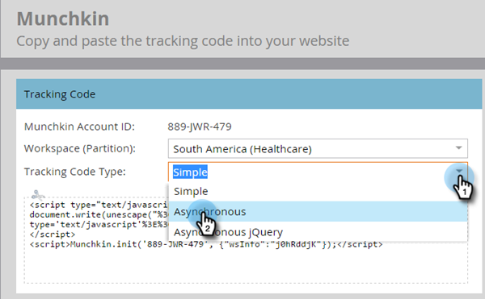

# Hinzufügen [!DNL Munchkin] Trackingcodes zu Ihrer Website {#add-munchkin-tracking-code-to-your-website}

Der benutzerdefinierte JavaScript-Trackingcode von Marketo namens [!DNL Munchkin] verfolgt alle Personen, die Ihre Website besuchen, sodass Sie mit automatisierten Marketing-Kampagnen auf ihre Besuche reagieren können. Sogar anonyme Besucher werden zusammen mit ihren IP-Adressen und anderen Informationen verfolgt. **Ohne diesen Trackingcode können Sie Besuche oder andere Aktivitäten auf Ihrer Website nicht verfolgen**!

>[!PREREQUISITES]
>
>Stellen Sie sicher, dass Sie Zugriff auf einen erfahrenen JavaScript-Entwickler haben. Der technische Support von Marketo unterstützt nicht bei der Fehlerbehebung bei benutzerdefiniertem JavaScript.

## Hinzufügen von Trackingcode zu Ihrer Website {#add-tracking-code-to-your-website}

>[!NOTE]
>
>Adobe Experience Cloud-Benutzer können auch die [Marketo-Integration in Adobe Launch](https://exchange.adobe.com/apps/ec/100223/adobe-launch-core-extension){target="_blank"} verwenden, um [!DNL Munchkin] Skript auf ihren Web-Seiten einzufügen. Wenn Sie Adobe Launch verwenden _(das [!DNL Munchkin] wird automatisch hinzugefügt_ sodass Sie es nicht selbst hinzufügen müssen.

1. Navigieren Sie zum Bereich **[!UICONTROL Admin]**.

   

1. Auf **[!UICONTROL Munchkin]**.

   

1. Wählen Sie **[!UICONTROL asynchron]** für **[!UICONTROL Trackingcode-Typ]** aus.

   

   >[!NOTE]
   >
   >In fast allen Fällen sollten Sie den asynchronen Code verwenden. [Weitere Informationen](#types-of-munchkin-tracking-codes).

1. Klicken Sie auf und kopieren Sie den JavaScript-Trackingcode, den Sie auf Ihrer Website einfügen möchten.

   

   >[!CAUTION]
   >
   >Verwenden Sie nicht den in diesem Screenshot gezeigten Code - Sie müssen den eindeutigen Code verwenden, der in Ihrem Konto angezeigt wird!

   >[!TIP]
   >
   >Fügen Sie den Trackingcode auf die Webseiten ein, die Sie verfolgen möchten. Dabei kann es sich um jede Seite für kleinere Websites handeln oder nur um wichtige Seiten auf Websites mit vielen dynamisch generierten Web-Seiten, Benutzerforen usw.

   Um die bestmöglichen Ergebnisse zu erzielen, verwenden Sie den asynchronen [!DNL Munchkin]-Code und platzieren Sie ihn in den `<head>` Elementen Ihrer Seiten. Wenn Sie den einfachen Code verwenden (nicht empfohlen), befindet sich dieser direkt vor dem `</body>`-Tag.

   

   >[!TIP]
   >
   >Bei Websites mit hohem Traffic-Volumen (d. h. Hunderttausende von Besuchen pro Monat) empfehlen wir, keine anonymen Personen zu verfolgen. [Weitere Informationen](https://experienceleague.adobe.com/en/docs/marketo-developer/marketo/javascriptapi/leadtracking/lead-tracking){target="_blank"}.

## Hinzufügen von Trackingcode bei Verwendung mehrerer Arbeitsbereiche {#add-tracking-code-when-using-multiple-workspaces}

Wenn Sie Arbeitsbereiche in Ihrem Marketo-Konto verwenden, verfügen Sie wahrscheinlich auch über separate Web-Präsenzen, die Ihren Arbeitsbereichen entsprechen. In diesem Fall können Sie das JavaScript zum Tracking von [!DNL Munchkin] verwenden, um Ihre anonymen Personen dem richtigen Arbeitsbereich und der richtigen Partition zuzuweisen.

1. Navigieren Sie zum Bereich **[!UICONTROL Admin]**.

   

1. Auf **[!UICONTROL Munchkin]**.

   

1. Wählen Sie den entsprechenden Arbeitsbereich für die Web-Seiten aus, die Sie verfolgen möchten.

   

   >[!NOTE]
   >
   >Wenn Sie den speziellen Workspace-[!DNL Munchkin]-Code nicht verwenden, werden die Personen der Standardpartition zugewiesen, die bei der Einrichtung Ihres Kontos erstellt wurde. Anfangs heißt sie &quot;[!UICONTROL Standard], aber möglicherweise haben Sie das in Ihrem eigenen Marketo-Konto geändert.

1. Wählen Sie **[!UICONTROL asynchron]** für **[!UICONTROL Trackingcode-Typ]** aus.

   

1. Klicken Sie auf und kopieren Sie den JavaScript-Trackingcode, den Sie auf Ihrer Website einfügen möchten.

   

   >[!CAUTION]
   >
   >Verwenden Sie nicht den in diesem Screenshot gezeigten Code - Sie müssen den eindeutigen Code verwenden, der in Ihrem Konto angezeigt wird!

1. Platzieren Sie den Trackingcode auf Ihren Web-Seiten im `<head>`. Neue Personen, die diese Seite besuchen, werden dieser Partition zugewiesen.

   

   >[!CAUTION]
   >
   >Sie können nur ein [!DNL Munchkin]-Tracking-Skript für eine einzelne Partition und einen einzigen Arbeitsbereich auf einer Seite verwenden. Schließen Sie keine Tracking-Skripte für mehrere Partitionen/Arbeitsbereiche auf Ihrer Website ein.

   >[!NOTE]
   >
   >In Marketo erstellte Landingpages enthalten automatisch Trackingcode, sodass Sie diesen Code nicht auf sie anwenden müssen.

## Typen von [!DNL Munchkin]-Trackingcodes {#types-of-munchkin-tracking-codes}

Es gibt drei Arten von [!DNL Munchkin]-Trackingcodes, aus denen Sie wählen können. Jede wirkt sich auf die Ladezeiten der Web-Seite unterschiedlich aus.

1. **[!UICONTROL Einfach]**: verfügt über die wenigsten Codezeilen, wird aber nicht für die Ladezeit der Web-Seite optimiert. Dieser Code lädt die jQuery-Bibliothek jedes Mal, wenn eine Web-Seite geladen wird.
1. **[!UICONTROL asynchron]**: Verringert die Ladezeit von Web-Seiten.
1. **[!UICONTROL Asynchrone jQuery]**: Verringert die Ladezeit der Web-Seite und verbessert auch die Systemleistung. In diesem Code wird davon ausgegangen, dass Sie bereits über jQuery verfügen, und es wird nicht geprüft, ob es geladen wird.

## Testen, ob der [!DNL Munchkin]-Code funktioniert {#test-if-your-munchkin-code-is-working}

So überprüfen Sie, ob Ihr [!DNL Munchkin]-Code nach dem Hinzufügen funktioniert:

1. Besuchen Sie Ihre Webseite.

1. Klicken Sie in Ihrem [!DNL My Marketo] auf die Kachel **[!UICONTROL Analytics]** .

   

1. Klicken Sie **[!UICONTROL Webseitenaktivität]**.

   

1. Klicken Sie auf **[!UICONTROL Registerkarte]** Setup“ und doppelklicken Sie auf **[!UICONTROL Activity Source]**.

   

1. Ändern Sie die [!UICONTROL Activity Source] in **[!UICONTROL Anonyme Besucher (einschließlich ISPs)]** und klicken Sie auf **[!UICONTROL Anwenden]**.

   

1. Klicken Sie auf **[!UICONTROL Registerkarte]** Bericht“.

   

   >[!NOTE]
   >
   >Wenn keine Daten angezeigt werden, warten Sie einige Minuten und klicken Sie dann unten auf [!UICONTROL Aktualisieren]-Symbol.
