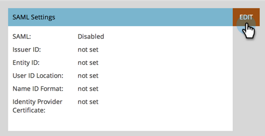

# Single Sign-On zu einem Portal hinzufügen {#add-single-sign-on-to-a-portal}

Wenn Sie über einen Verzeichnisdienst verfügen, der Benutzer authentifiziert, können Sie die einmalige Anmeldung (SSO) in Marketo zulassen. Diese Funktion wird mit der Version 2.0 (SAML) und höher von [!DNL Security Assertion Markup Language] unterstützt.

Marketo fungiert als SAML-Dienstanbieter (SP) und benötigt zur Authentifizierung von Benutzern einen externen Identitäts-Provider (IdP).

Sobald die einmalige Anmeldung aktiviert ist, kann der IdP die Anmeldeinformationen eines Benutzers überprüfen. Wenn ein Benutzer die Marketo-Software verwenden möchte, sendet der IdP dann eine signierte SAML-Nachricht an Marketo, die als SP fungiert. Diese Meldung bestätigt Marketo, dass der Benutzer zur Verwendung von Marketo-Software berechtigt ist.

>[!NOTE]
>
>**Erforderliche Administratorberechtigungen**

>[!IMPORTANT]
>
>Dies gilt nicht für Anmeldungen, die mit Adobe Identity integriert wurden. Für Adobe Identity-Anmeldungen wird Single Sign-On auf der Adobe-Org-Ebene in Adobe Admin Console eingerichtet. [Weitere Informationen finden Sie hier](https://helpx.adobe.com/de/enterprise/using/set-up-identity.html){target="_blank"}.

>[!NOTE]
>
>Sind Sie ein [!DNL Microsoft Azure] Benutzer? Sehen Sie sich ihr [Integrations-Tutorial](https://azure.microsoft.com/en-us/documentation/articles/active-directory-saas-marketo-tutorial/){target="_blank"} an. FYI, es gibt einen Tippfehler in Schritt 5c ihres Tutorials. Stellen Sie den Relay-Status auf `https://<munchkinid>.mktoweb.com`, **_nicht_** `https://<munchkinid>.marketo.com` ein.

## Senden der Anforderung {#how-to-send-the-request}

* Senden Sie die SSO-Anfrage, die eine SAML-Antwort ist, an `https://login.marketo.com/saml/assertion/<your-munchkin-id>`
* Als Zielgruppen-URL der SP. Verwenden Sie `http://saml.marketo.com/sp`
* Wenn Sie das Attribut SPNameQualifier verwenden, setzen Sie das Element NameID für Subject auf `http://saml.marketo.com/sp`
* Wenn Sie mehrere Marketo-Abonnements mit demselben SSO-Provider verknüpfen, können Sie eindeutige SP-URLs für jeden Marketo-Unterordner im Format `http://saml.marketo.com/sp/<munchkin_id>` verwenden.

>[!NOTE]
>
>Marketo unterstützt nur Identity Provider-initiierte (auch als IdP-Initiated bezeichnete) Anwendungen, bei denen der Benutzer zuerst die IP-Anmeldeseite startet, sich authentifiziert und dann zu My Marketo navigiert.

## Weitere Hinweise {#additional-notes}

* **Synchronisierungszeit** - Für einen neuen Benutzer dauert es etwa 10 Minuten, bis eine erste SSO-Anfrage verarbeitet wird.
* **Benutzerbereitstellung** - Benutzer werden manuell von Marketo bereitgestellt.
* **Autorisierung** - Benutzerberechtigungen werden in Marketo verwaltet.
* **OAuth-Unterstützung** - Marketo unterstützt OAuth derzeit nicht.
* **Automatische Benutzerübertragung** - Wird auch als &quot;Just in Time Provisioning&quot;bezeichnet. Dies ist der Fall, wenn die erste SAML-Anmeldung eines Benutzers in der Lage ist, den Benutzer in einer beliebigen Webanwendung zu erstellen, auf die er zugreift (z. B. Marketo), und keine manuelle Administratoraktion erforderlich ist. Dies wird derzeit von Marketo nicht unterstützt.
* **Verschlüsselung** - Marketo unterstützt derzeit nicht die Verschlüsselung.

>[!NOTE]
>
>Vergewissern Sie sich vor dem Start, dass Ihr Identitätsanbieter-Zertifikat im X.509-Format und in der Erweiterung .crt, .der oder .cer vorliegt.

## SAML-Einstellungen aktualisieren {#update-saml-settings}

Die einmalige Anmeldung ist standardmäßig deaktiviert. Führen Sie diese Schritte aus, um SAML zu aktivieren und zu konfigurieren.

1. Wechseln Sie zum Bereich **[!UICONTROL Admin]** .

   

1. Klicken Sie auf **[!UICONTROL Single Sign-On]**.

   

   >[!NOTE]
   >
   >Wenn unter **[!UICONTROL Admin]** **[!UICONTROL Single Sign-On]** nicht angezeigt wird, wenden Sie sich an den [Marketo-Support](https://nation.marketo.com/t5/Support/ct-p/Support){target="_blank"}.

1. Klicken Sie unter dem Abschnitt **[!UICONTROL SAML-Einstellungen]** auf **[!UICONTROL Bearbeiten]**.

   

1. Ändern Sie **[!UICONTROL SAML Single Sign-On]** in **[!UICONTROL Enabled]**.

   

1. Geben Sie Ihre **[!UICONTROL Aussteller-ID]**, **[!UICONTROL Entitäts-ID]** ein, wählen Sie den **[!UICONTROL Benutzer-ID-Speicherort]** aus und klicken Sie dann auf **[!UICONTROL Durchsuchen]**.

   

1. Wählen Sie die Datei **[!UICONTROL Identitätsanbieter-Zertifikat]** aus.

   

1. Klicken Sie auf **[!UICONTROL Speichern]**.

   

## Einstellungen für Umleitungsseiten aktualisieren {#update-redirect-page-settings}

1. Klicken Sie unter dem Abschnitt **[!UICONTROL Umleitungsseiten]** auf **[!UICONTROL Bearbeiten]**.

   

   >[!NOTE]
   >
   >Kunden, die eine universelle ID zusammen mit SSO verwenden, müssen die Anmelde-URL des Identitätsanbieters in das Feld **[!UICONTROL Anmelde-URL]** eingeben.

1. Geben Sie eine **[!UICONTROL Abmelde-URL]** ein. Dies ist die URL, zu der der Benutzer weitergeleitet werden soll, wenn er sich von Marketo abmeldet.

   

1. Geben Sie eine **[!UICONTROL Fehler-URL]** ein. Dies ist die URL, zu der der Benutzer weitergeleitet werden soll, falls die Anmeldung bei Marketo fehlschlägt. Klicken Sie auf **[!UICONTROL Speichern]**.

   

   >[!NOTE]
   >
   >Beide Seiten müssen öffentlich zugänglich sein.

>[!MORELIKETHIS]
>
>* [Verwenden einer universellen ID für die Anmeldung bei Abonnements](/help/marketo/product-docs/administration/settings/using-a-universal-id-for-subscription-login.md){target="_blank"}
>* [Benutzeranmeldung auf SSO beschränken](/help/marketo/product-docs/administration/additional-integrations/restrict-user-login-to-sso-only.md){target="_blank"}
>* [Einladen von Marketo-Benutzern zu zwei Instanzen mit universeller ID](https://nation.marketo.com/t5/Knowledgebase/Inviting-Marketo-Users-to-Two-Instances-with-Universal-ID-UID/ta-p/251122){target="_blank"}
