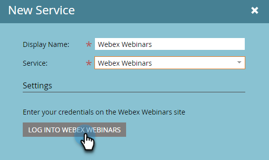

# Hinzufügen von [!DNL Webex] as a [!DNL LaunchPoint] Service {#add-webex-as-a-launchpoint-service}

Marketo Engage verwaltet die Registrierung und Teilnahme an [!DNL Webex] Webinaren. Sie müssen über ein vorhandenes Abonnement für [[!UICONTROL WebEx]](https://www.webex.com/) verfügen.

>[!NOTE]
>
>**Administratorberechtigungen erforderlich**

1. Navigieren Sie zum Bereich **[!UICONTROL Admin]**.

   

1. Klicken Sie **[!UICONTROL LaunchPoint]**.

   

1. Wählen Sie **[!UICONTROL Neu]** und dann **[!UICONTROL Neuer Service]** aus.

   

1. Geben Sie einen **[!UICONTROL Anzeigenamen]** ein. Wählen Sie in **[!UICONTROL Dropdown]** Service die Option **[!UICONTROL Webinare]** aus.

   

1. Klicken Sie auf **[!UICONTROL Bei WebEx-Webinaren anmelden]**.

   

1. WebEx wird in einer neuen Registerkarte geöffnet. Melden Sie sich mit Ihren WebEx-Anmeldeinformationen an.

   

1. Nach erfolgreicher Anmeldung wird die Registerkarte geschlossen und das Modal _Neuer Service_ in Marketo Engage lautet „WebEx Webinars-Konto ist eingerichtet“. Klicken Sie auf **[!UICONTROL Erstellen]**.

   

Ihr **[!DNL Webex]** ist jetzt mit Marketo synchronisiert.

>[!MORELIKETHIS]
>
>[Ereignis erstellen mit [!DNL Webex]](/help/marketo/product-docs/demand-generation/events/create-an-event/create-an-event-with-webex.md){target="_blank"}.
