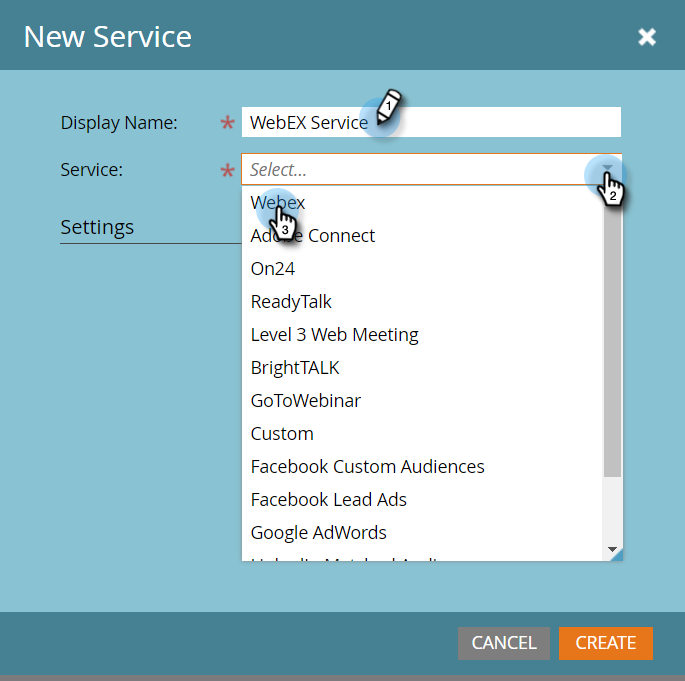

# hinzufügen von WebEx als LaunchPoint-Dienst {#add-webex-as-a-launchpoint-service}

Marketo verwaltet Ihre WebEx-Webinarregistrierung und -Teilnahme.

>[!NOTE]
>
>**Administratorberechtigungen erforderlich**

>[!NOTE]
>
>**Erinnerung**
>
>Für diesen Schritt ist ein bestehendes Abonnement zu WebEx- und Verwaltungsrechten erforderlich. Legen Sie die folgenden Einstellungen fest: Benutzername, Kennwort und Site-Name.

>[!NOTE]
>
>Der Site-Name befindet sich am Ende der URL, die zum Anmelden bei WebEx verwendet wird. Beispiel:
>
>`https://mycompany.webex.com/mw0300lc/mywebex/default.do?siteurl=**mycompa**`**ny**
>
>Vorsicht: Geben Sie nicht die gesamte URL in dieses Feld ein; nur den Site-Namen eingeben!

1. Gehen Sie zu **Admin** und klicken Sie auf **LaunchPoint**.

   

1. Wählen Sie **Neu** und dann **Neuer Dienst**.

   

1. Geben Sie einen **Anzeigenamen** ein. Wählen Sie unter **Dienst****WebEx**.

   

1. Geben Sie Ihren **Benutzernamen** und Ihr **Passwort** ein.

   

1. Schließen Sie den Prozess ab, indem Sie Ihren** Site-Namen** eingeben und dann auf **Erstellen** klicken.

   

1. Phänomenal! Ihr **WebEx** wird jetzt mit Marketo synchronisiert.

   

>[!MORELIKETHIS]
>
>Erfahren Sie, wie Sie mit WebEx ein Ereignis [erstellen](../../../product-docs/demand-generation/events/create-an-event/create-an-event-with-webex.md).

