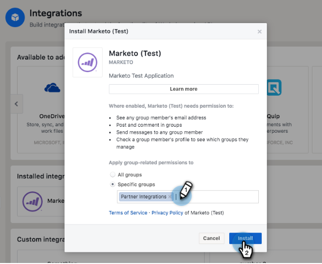

# hinzufügen Workplace By Facebook als LaunchPoint-Dienst {#add-workplace-by-facebook-as-a-launchpoint-service}

Die Integration in Workplace umfasst zwei Benachrichtigungstypen:

* **Systembenachrichtigungen**: Rufen Sie Benachrichtigungen über wichtige Ereignis in Ihrer Marketing-Instanz ab, z. B. Warnungen über den Status der aktuellen Kampagne und Probleme, die sofortige Aufmerksamkeit erfordern (CRM-Fehler und API-Beschränkungen).
* **Interessante Momente**: Wenn ein Marketo Insight von einer bekannten Person aus einem Kundenkonto ausgelöst wurde, können Interessentenbesitzer über Workplace benachrichtigt werden. Benachrichtigungen enthalten Interessenteninformationen sowie Details zum Kundenkonto.

>[!NOTE]
>
>**Administratorberechtigungen erforderlich**

>[!PREREQUISITES]
>
>Wenn Sie noch keine Workspace-Benachrichtigungen aktiviert haben, [wenden Sie sich bitte an den Support](http://docs.marketo.com/cdn-cgi/l/email-protection#5b282e2b2b34292f1b363a29303e2f3475383436).

1. Gehen Sie zu **LaunchPoint** und klicken Sie unter **New** auf **New Service**.

   

1. Geben Sie einen Anzeigenamen für Ihre Workplace-Integration ein. Wählen Sie in der Dropdownliste **Dienst** die Option **Arbeitsplatz nach Facebook**. Klicken Sie auf **Erstellen**.

   

1. Um Systembenachrichtigungen und interessante Momente zu erhalten, lassen Sie die Optionen unverändert. Klicken Sie auf **Erstellen**.

   

1. Klicken Sie auf **Autorisieren**. Dadurch wird Workplace in einer neuen Registerkarte geöffnet, auf der Sie die Autorisierung abschließen und Marketo die Erlaubnis erteilen, Informationen von Workplace abzurufen.

   

1. Geben Sie auf der neuen Registerkarte &quot;Arbeitsplatz&quot;Ihre geschäftliche E-Mail-Adresse oder Ihren Arbeitsplatz-Benutzernamen ein und klicken Sie auf **Weiter**.

   

1. Geben Sie Ihre Anmeldeinformationen für den Arbeitsplatz ein und klicken Sie auf **Anmelden**.

   

1. Wählen Sie im Popup &quot;Arbeitsplatz&quot;eine Facebook-Gruppe aus, für die Benachrichtigungen von Marketing veröffentlicht werden sollen (z. B. Partnerintegrationen). Klicken Sie auf **Installieren**.

   

1. Die Bestätigungsmeldung wird unten angezeigt. Die Registerkarte wird automatisch geschlossen.

   

1. Aktualisieren Sie die Registerkarte &quot;Markieren&quot;und vergewissern Sie sich, dass Workplace jetzt als aktiver Dienst in LaunchPoint aufgeführt wird.

   

   Benachrichtigungen beginnen nun mit der Veröffentlichung für die in Schritt 7 ausgewählte Facebook-Gruppe. Sie werden ungefähr so aussehen:

   

