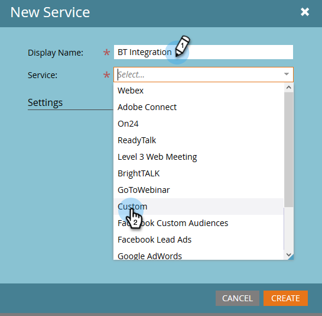

# Verbinden von [!DNL BrightTALK] mit Marketo {#connect-brighttalk-to-marketo}

Erfahren Sie, wie Sie Ihren [!DNL BrightTALK]-Kanal mit Ihrer Marketo-Instanz verbinden. Dazu müssen Sie ein Administrator für beide sein.

>[!NOTE]
>
>**Admin-Berechtigungen erforderlich**

## Schritte in [!DNL BrightTALK] {#steps-in-brighttalk}

1. Melden Sie sich bei [business.brighttalk.com/demandcentral an ](https://business.brighttalk.com/demandcentral/login){target="_blank"} klicken Sie auf **[!UICONTROL Jetzt verbinden]**.
1. Klicken [!UICONTROL  unter „Erweiterter Marketo-]&quot; auf **[!UICONTROL Verbinden]**.
1. Sie gelangen zum Bildschirm mit den Anmeldeinformationen und fragen nach: Client-ID, Client-Geheimnis, Identity Service-URL und REST-Service-URL. Um diese Informationen zu erhalten, melden Sie sich bei Marketo an.

## Schritte in Marketo {#steps-in-marketo}

>[!NOTE]
>
>Zu diesem Zeitpunkt müssen Sie ein [!DNL API Only User Role] und ein [!DNL API User] einrichten, um die Berechtigungen einzuschränken, die [!DNL BrightTALK] in Ihrer Marketo-Instanz haben. Da wir bereits Artikel für diese Schritte haben, werden wir Sie mit ihnen verknüpfen.

1. Erstellen Sie eine [Benutzerrolle nur für API](/help/marketo/product-docs/administration/users-and-roles/create-an-api-only-user-role.md){target="_blank"}.

1. [Erstellen eines API-](/help/marketo/product-docs/administration/marketo-with-adobe-identity/add-api-only-user-for-adobe-ims-enabled-subscriptions.md){target="_blank"} mithilfe der [!DNL BrightTALK] API-Rolle, die Sie in Schritt 4 erstellt haben.

1. Gehen Sie zurück zum Bereich **[!UICONTROL Admin]**.

   

1. Klicken **[!UICONTROL unter &quot;]** Integration **[!UICONTROL auf LaunchPoint]**.

   

1. Klicken Sie auf **[!UICONTROL Neu]** und wählen Sie **[!UICONTROL Neuer Service]**.

   

1. Geben **[!UICONTROL einen]** Anzeigenamen ein. Klicken Sie auf **[!UICONTROL Dienst]** und wählen Sie **[!UICONTROL Benutzerdefiniert]** (_nicht_ [!DNL BrightTALK]).

   

   >[!CAUTION]
   >
   >Denken Sie daran, [!DNL BrightTALK] nicht in der Dropdown-Liste auszuwählen. Dieses Feld werden wir derzeit entfernen. Seine Auswahl könnte zu erheblichen Problemen mit Ihrer [!DNL Marketo/BrightTALK]-Integration führen.

1. Geben Sie [!UICONTROL  gewünschte ] ein. Klicken Sie auf die **[!UICONTROL Nur API-Benutzer]** Dropdown-Liste und wählen Sie die [!DNL BrightTALK API User] aus, die Sie in Schritt 5 erstellt haben. Klicken Sie auf **[!UICONTROL Erstellen]**.

   

1. Klicken Sie **[!UICONTROL Details anzeigen]** für den soeben erstellten benutzerdefinierten Service.

   

1. Kopieren Sie (und speichern) die **[!UICONTROL Client-ID]** und **[!UICONTROL Client-Geheimnis]**. Klicken Sie auf **[!UICONTROL Schließen]**.

   

1. Wählen **[!UICONTROL unter]** die Option **[!UICONTROL Web-Services]** aus.

   

1. Kopieren **[!UICONTROL unter „REST]** API“ den **[!UICONTROL Endpunkt]** und **[!UICONTROL Identität]**.

   

## Zusätzliche Schritte in [!DNL BrightTALK] {#additional-steps-in-brighttalk}

1. Kehren Sie von Schritt 3 zum Einrichtungsbildschirm des [!DNL BrightTALK]-Connectors zurück und geben Sie die Anmeldeinformationen ein, die Sie in den Schritten 12 und 14 gespeichert haben.

Nachdem die Anmeldeinformationen authentifiziert wurden, haben Sie [!DNL BrightTALK] offiziell mit Marketo verbunden. Der nächste Schritt besteht darin, zu bestimmen, welche Datenfelder Sie synchronisieren möchten. Wenn Sie dabei Hilfe benötigen, wenden Sie sich bitte an den Support unter [BrightTALK](https://www.brighttalk.com/){target="_blank"}.
