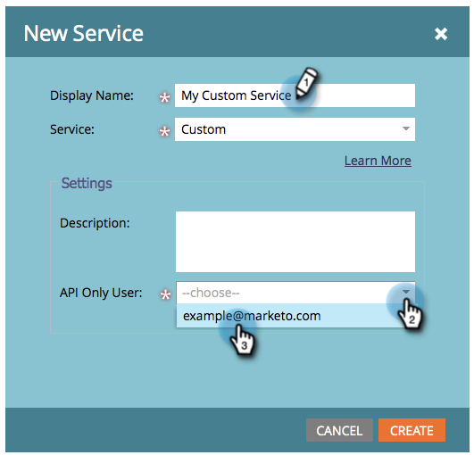

# Erstellen eines benutzerdefinierten Dienstes zur Verwendung mit der ReST-API {#create-a-custom-service-for-use-with-rest-api}

Wenn Sie die Integration mit Marketo über die ReST-API durchführen möchten, möchten Sie einen benutzerdefinierten Dienst erstellen. So geht es.

>[!PREREQUISITES]
>
>* [Erstellen einer reinen API-Benutzerrolle](/help/marketo/product-docs/administration/users-and-roles/create-an-api-only-user-role.md)
>* [Erstellen eines reinen API-Benutzers](/help/marketo/product-docs/administration/users-and-roles/create-an-api-only-user.md)
>

>[!NOTE]
>
>**Erforderliche Administratorberechtigungen**

>[!TIP]
>
>Weitere Informationen zur [REST-API](https://developer.adobe.com/marketo-apis/) finden Sie in der Entwicklerdokumentation . Wir verfügen auch über die [SOAP-API](https://experienceleague.adobe.com/en/docs/marketo-developer/marketo/soap/soap-api) , wenn Sie dies benötigen.

## Benutzerspezifischen Dienst erstellen {#create-custom-service}

1. Wechseln Sie zum Bereich **[!UICONTROL Admin]** .

   

1. Klicken Sie auf **LaunchPoint**.

   

1. Wählen Sie **[!UICONTROL Neu]** und dann **[!UICONTROL Neuer Dienst]** aus.

   

1. Geben Sie einen **[!UICONTROL Anzeigenamen]** für den Dienst ein. Wählen Sie den zuvor erstellten **[!UICONTROL Nur API-Benutzer]** [ aus.](/help/marketo/product-docs/administration/users-and-roles/create-an-api-only-user.md)

   

   >[!NOTE]
   >
   >Beachten Sie, dass wir bereits eine native Integration für beliebte Webinar-Dienste haben.

1. Klicken Sie auf **[!UICONTROL Erstellen]**.

   

   Oh ja! Der Dienst wird jetzt erstellt. Lassen Sie uns fortfahren und alle Anmeldedaten abrufen, um Zugriff bereitzustellen.

## Anmeldedaten für den API-Zugriff {#credentials-for-api-access}

1. Wechseln Sie zum Bereich **[!UICONTROL Admin]** .

   

1. Klicken Sie auf **[!UICONTROL LaunchPoint]**.

   

1. Klicken Sie für den oben erstellten benutzerdefinierten [!UICONTROL LaunchPoint]-Dienst auf **[!UICONTROL Details anzeigen]** .

   

1. Klicken Sie auf **[!UICONTROL Token abrufen]**.

   

1. Stellen Sie die **[!UICONTROL Client-ID]**, das **[!UICONTROL Client-Geheimnis]**, den **[!UICONTROL autorisierten Benutzer]** und den **[!UICONTROL Token]** der Person bereit, die für die Herstellung der Verbindung verantwortlich ist.

   

>[!CAUTION]
>
>Geben Sie diese Informationen nicht weiter, sondern sind die Hintertür Ihrer Daten. Halte es sicher!
