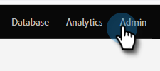

# Erstellen einer Zulassungsliste für IP-basierten API-Zugriff {#create-an-allowlist-for-ip-based-api-access}

Manchmal soll der API-Zugriff nur auf eine bestimmte IP-Adresse oder einen Adressenbereich gewährt werden. Dazu aktivieren Sie zunächst die Einschränkungen und geben dann die IP-Adressen an, die die APIs verwenden dürfen.

>[!NOTE]
>
>**Admin-Berechtigungen erforderlich**

1. Navigieren Sie zum Bereich **[!UICONTROL Admin]**.

   

1. Klicken Sie auf **[!UICONTROL Web-Services]**.

   

1. Klicken Sie **[!UICONTROL Bereich „IP]** Einschränkungen“ auf **[!UICONTROL Bearbeiten] oder** oder klicken Sie **[!UICONTROL IP-Einschränkungen bearbeiten]** oben links.

   

1. Markieren Sie das **[!UICONTROL IP-Beschränkungen aktivieren]** und geben Sie die IP-Adressen ein, die Sie ändern möchten.

   

   >[!NOTE]
   >
   >Sie können eine einzelne IP-Adresse oder einen Bereich davon eingeben oder einen Platzhalter verwenden.

1. Klicken Sie auf **[!UICONTROL Hinzufügen]**, um zusätzliche Felder zu öffnen und weitere IP-Adressen einzugeben.

   

1. Klicken Sie auf **[!UICONTROL Speichern]**.

   
