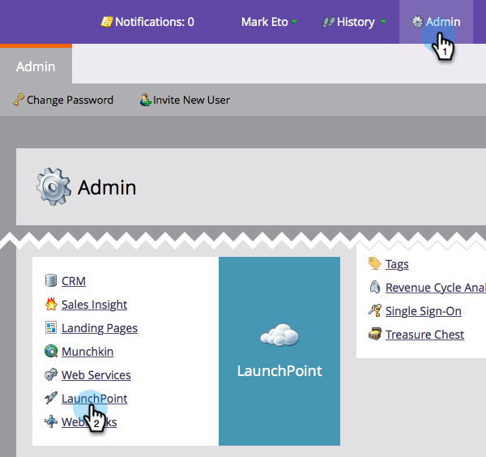

# GoogleAdwords Aktivität Log {#download-googleadwords-activity-log} herunterladen

Stuff passiert. Manchmal müssen Sie das Aktivitäten-Protokoll herunterladen, um Probleme zu beheben.

1. Gehen Sie zu **Admin** und klicken Sie auf **LaunchPoint**.

   

1. Suchen Sie Ihren Google AdWords-Dienst und klicken Sie auf **Aktivität-Protokoll herunterladen**.

   

1. Eine ZIP-Datei wird auf Ihren Computer heruntergeladen.
