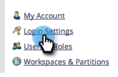

# Benutzeranmeldung auf SSO beschränken {#restrict-user-login-to-sso-only}

Wenn Sie [SSO verwenden](/help/marketo/product-docs/administration/additional-integrations/add-single-sign-on-to-a-portal.md) und sicherstellen möchten, dass Benutzer die SSO-Sicherheit nicht umgehen können, befolgen Sie diese Anweisungen.

>[!IMPORTANT]
>
>Dieser Artikel gilt nicht für Marketo[Abonnements mit aktiviertem ](/help/marketo/product-docs/administration/marketo-with-adobe-identity/adobe-identity-management-overview.md).

>[!NOTE]
>
>**Administratorberechtigungen erforderlich**

1. Navigieren Sie zum Bereich **[!UICONTROL Admin]**.

   

1. Klicken Sie **[!UICONTROL Anmeldeeinstellungen]**.

   

1. Klicken Sie **[!UICONTROL Sicherheitseinstellungen bearbeiten]**.

   

1. Erweitern Sie **[!UICONTROL Erweitert]**, aktivieren Sie **[!UICONTROL SSO erforderlich]** und klicken Sie auf **[!UICONTROL Speichern]**.

>[!NOTE]
>
>Es empfiehlt sich, die Benutzer einzuladen und die Einladung anzunehmen. _Nachdem_ Einladung angenommen wurde, sollten Administratoren sie auf &quot;[!UICONTROL SSO erforderlich“ ].

>[!TIP]
>
>Wenn Sie **[!UICONTROL SSO erforderlich]** auswählen, können Sie eine [Benutzerrolle](/help/marketo/product-docs/administration/users-and-roles/create-delete-edit-and-change-a-user-role.md) von dieser Einschränkung ausschließen, indem Sie die Option **[!UICONTROL Einmaliges Anmelden umgehen]** beim Einrichten der Rolle aktivieren. Dadurch können sich Benutzer normal anmelden. Beispielsweise müssen sich Administratorbenutzer möglicherweise weiterhin über den Anmeldebildschirm bei Marketo anmelden. Wenn sowohl SSO als auch universelle ID aktiviert sind, müssen Sie die Berechtigung zum Umgehen von Single Sign-On besitzen, um zwischen Abonnements umzuschalten.

>[!CAUTION]
>
>Wenn neue Benutzer eingeladen werden, erhalten sie Einladungs-E-Mails. Wenn jedoch **[!UICONTROL SSO erforderlich]** ausgewählt ist, erhalten diese E-Mails nicht, es sei denn, sie wurden einer Rolle zugewiesen, die auf **[!UICONTROL Single Sign-On umgehen]** festgelegt ist.

Das ist alles! Jetzt sind alle Benutzer (mit Ausnahme der Benutzer mit der Berechtigung, das einmalige Anmelden zu umgehen) auf die Verwendung der SSO-Anmeldung beschränkt.

>[!MORELIKETHIS]
>
>* [Hinzufügen von Single Sign-on zu einem Portal](/help/marketo/product-docs/administration/additional-integrations/add-single-sign-on-to-a-portal.md)
>* [Verwenden einer universellen ID für die Anmeldung bei einem Abonnement](/help/marketo/product-docs/administration/settings/using-a-universal-id-for-subscription-login.md)
>* [Einladen von Marketo-Benutzern zu zwei Instanzen mit universeller ID](https://nation.marketo.com/t5/Knowledgebase/Inviting-Marketo-Users-to-Two-Instances-with-Universal-ID-UID/ta-p/251122)
