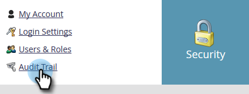

# Filtern im Audit-Protokoll {#filtering-in-audit-trail}

Filtern Sie nach Zeitrahmen, Asset-Typ, Benutzern, durchgeführten Aktionen und mehr.

1. Klicken Sie auf **[!UICONTROL Admin]**.

   

1. Wählen **[!UICONTROL unter]** die Option **[!UICONTROL Audit-Protokoll]** aus.

   

1. Klicken Sie auf das Filtersymbol.

   

   >[!NOTE]
   >
   >Es gibt eine Vielzahl von möglichen Suchparameter-Kombinationen. In diesem Beispiel suchen wir: _Alle E-Mails - von jedem bearbeitet - in den letzten sieben Tagen_.

1. Klicken Sie auf **[!UICONTROL Zeitraum]** und wählen Sie **[!UICONTROL Letzte 7 Tage]** aus.

   

1. Klicken Sie auf **[!UICONTROL Asset-Typ]** und wählen Sie **[!UICONTROL E-Mail]** aus.

   

1. Klicken Sie auf die **Aactions** Dropdown-Liste und wählen Sie **[!UICONTROL Bearbeiten]**.

   

1. Klicken Sie auf **[!UICONTROL Übernehmen]**.

   

1. Gefilterte Ergebnisse werden auf der linken Seite angezeigt.

   

   Das war&#39;s!

   >[!NOTE]
   >
   >Wenn Sie Arbeitsbereiche aktiviert haben, werden Überwachungsdaten für alle Arbeitsbereiche angezeigt. Wenn Sie einen Arbeitsbereichsfilter anwenden, speichert Marketo bei jeder Verwendung des Audit-Protokolls den vorherigen Arbeitsbereichswert. Workspace-Berechtigungen auf Asset-Ebene werden erzwungen.

   >[!MORELIKETHIS]
   >
   >[Details im Audit-Protokoll ändern](/help/marketo/product-docs/administration/audit-trail/change-details-in-audit-trail.md)
