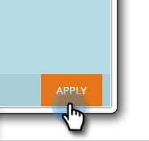

# Verlauf der Benutzeranmeldungen {#user-login-history}

Der Anmeldeverlauf des Benutzers hilft Ihnen bei der Aufrechterhaltung der Rechenschaftspflicht und Sicherheit, indem er Ihnen genau zeigt, wer sich bei Ihrem Abonnement angemeldet hat, einschließlich fehlgeschlagener Anmeldeversuche.

>[!PREREQUISITES]
>
>Es muss eine Rolle vorhanden sein, für die die Berechtigung „Zugriff auf Anmeldeverlauf“ aktiviert ist, um den Anmeldeverlauf des Benutzers anzeigen zu können.

Der Anmeldeverlauf des Benutzers identifiziert Personen, die sich wie folgt anmelden:

* Anmeldezeit und -datum
* Name und E-Mail-Adresse des Benutzers
* Rolle
* Arbeitsbereich
* IP-Adresse

So zeigen Sie den Anmeldeverlauf für Benutzer an:

1. Navigieren Sie zum Bereich **[!UICONTROL Admin]**.

   

1. Klicken Sie unter Sicherheit auf **[!UICONTROL Benutzer und Rollen]**.

   

1. Klicken Sie auf **[!UICONTROL Registerkarte „Anmeldeverlauf]**. Die Liste enthält die letzten Anmeldungen.

   

1. Verwenden Sie den Filter , um Ihre Suche einzugrenzen.

   

1. Wählen Sie mithilfe der Datumsauswahl einen Datumsbereich aus.

   

1. Oder wählen Sie aus dem Dropdown-Menü aus.

   

1. Wählen Sie die Benutzer aus **[!UICONTROL Dropdown-Liste]** Benutzer“ aus.

   

1. Aktivieren Sie das **[!UICONTROL Nur fehlgeschlagene Anmeldungen]**, um bei Ihrer Suche nur fehlgeschlagene Anmeldungen anzuzeigen.

   

1. Klicken Sie auf **[!UICONTROL Übernehmen]**.

   

   >[!NOTE]
   >
   >Die Benutzeroberfläche zeigt Daten von bis zu 30 Tagen an. Wenn Sie mehr benötigen, können Sie die Daten der letzten sechs Monate in eine CSV-Datei herunterladen.

   >[!MORELIKETHIS]
   >
   >[Audit-Protokoll - Übersicht](/help/marketo/product-docs/administration/audit-trail/audit-trail-overview.md)
