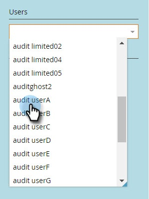

# Anmeldeverlauf für Benutzer {#user-login-history}

Der User Login History hilft Ihnen, die Verantwortlichkeit und Sicherheit zu wahren, indem er genau anzeigt, wer sich bei Ihrem Abonnement angemeldet hat, einschließlich fehlgeschlagener Anmeldeversuche.

>[!PREREQUISITES]
>
>Sie müssen über eine Rolle verfügen, für die die Berechtigung Zugriffslogin-Verlauf aktiviert ist, um den Benutzeranmeldeverlauf anzeigen zu können.

Der User Login History identifiziert Personen, die sich anmelden über:

* Anmeldungszeit und -datum
* Name und E-Mail-Adresse des Benutzers
* Role
* Arbeitsbereich
* IP-Adresse

So zeigen Sie den Verlauf der Benutzeranmeldung an:

1. Wechseln Sie zum Bereich **[!UICONTROL Admin]** .

   

1. Klicken Sie unter &quot;Security&quot;auf **[!UICONTROL Users &amp; Roles]**.

   

1. Klicken Sie auf die Registerkarte **[!UICONTROL Anmeldeverlauf]** . Die Liste enthält die neuesten Anmeldedaten.

   

1. Verwenden Sie den Filter , um die Suche einzuschränken.

   

1. Wählen Sie mithilfe der Datumsauswahl einen Datumsbereich aus.

   

1. Oder wählen Sie aus der Dropdown-Liste aus.

   

1. Wählen Sie die Benutzer aus der Dropdownliste **[!UICONTROL Benutzer]** aus.

   

1. Aktivieren Sie die Option **[!UICONTROL Nur fehlgeschlagene Anmeldungen]** , um nur fehlgeschlagene Anmeldungen bei der Suche anzuzeigen.

   

1. Klicken Sie auf **[!UICONTROL Anwenden]**.

   

   >[!NOTE]
   >
   >In der Benutzeroberfläche werden Daten von bis zu 30 Tagen angezeigt. Wenn Sie mehr benötigen, können Sie die Daten der letzten sechs Monate in eine CSV-Datei herunterladen.

   >[!MORELIKETHIS]
   >
   >[Audit-Protokoll - Überblick](/help/marketo/product-docs/administration/audit-trail/audit-trail-overview.md)
