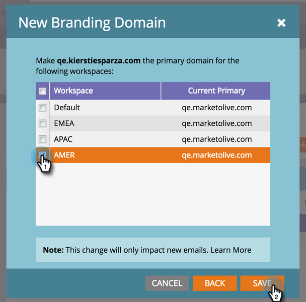

# hinzufügen einer zusätzlichen Branding-Domäne mit Arbeitsbereichen {#add-an-additional-branding-domain-with-workspaces}

Wenn Sie Arbeitsbereiche haben, können Sie zusätzliche Branding-Domänen hinzufügen.

>[!PREREQUISITES]
>
>Sie müssen zuerst Ihre Standard-Brandingdomäne [bearbeiten](edit-your-default-branding-domain.md) .
>
>Sie müssen zuerst den generischen Verfolgungslink [durch eine Brandingdomäne](edit-your-default-branding-domain-with-workspaces.md) ersetzen, bevor Sie zusätzliche Branding-Domänen hinzufügen.

1. Gehen Sie zu **Admin **und klicken Sie dann auf **E-Mail**.

   

1. Klicken Sie auf **Hinzufügen **um eine zusätzliche Branding-Domäne hinzuzufügen.

   

1. Geben Sie eine neue Markendomäne ein. Klicken Sie auf **Weiter**.

   

   >[!NOTE]
   >
   >Sie können diese Domäne für einen oder mehrere Arbeitsbereiche als Primär festlegen. Alle vorhandenen nicht gesendeten E-Mails mit der Einstellung &quot;Standard&quot;und alle neu erstellten E-Mails werden standardmäßig auf die primäre Domäne eingestellt. Sie können dies per E-Mail außer Kraft setzen.

1. Wählen Sie die neue Markendomäne aus und klicken Sie auf **Speichern**.

   

