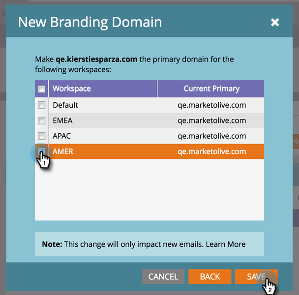

# Hinzufügen einer zusätzlichen Branding-Domain mit Arbeitsbereichen {#add-an-additional-branding-domain-with-workspaces}

Wenn Sie über Arbeitsbereiche verfügen, können Sie zusätzliche Branding-Domains hinzufügen.

>[!PREREQUISITES]
>
>* [Standard-Branding-Domain bearbeiten](/help/marketo/product-docs/administration/email-setup/add-multiple-branding-domains/edit-your-default-branding-domain.md).
>
>* [Ersetzen Sie den generischen Tracking](/help/marketo/product-docs/administration/email-setup/add-multiple-branding-domains/edit-your-default-branding-domain-with-workspaces.md)Link durch eine Branding-Domain, bevor Sie weitere Branding-Domains hinzufügen.

1. Navigieren Sie zum Bereich **[!UICONTROL Admin]**.

   

1. Klicken Sie auf **[!UICONTROL E-Mail]**.

   

1. Klicken Sie **[!UICONTROL Hinzufügen]**, um eine zusätzliche Branding-Domain hinzuzufügen.

   

1. Geben Sie eine neue Branding-Domain ein. Klicken Sie auf **[!UICONTROL Weiter]**.

   

   >[!NOTE]
   >
   >Sie können diese Domain zu Ihrer primären Domain für einen oder mehrere Arbeitsbereiche machen. Alle vorhandenen nicht gesendeten E-Mails, die auf „Standard“ eingestellt sind, und alle neu erstellten E-Mails werden standardmäßig auf die primäre Domain gesetzt. Sie können dies für jede E-Mail überschreiben.

1. Wählen Sie die neue Branding-Domain aus und klicken Sie auf **[!UICONTROL Speichern]**.

   
