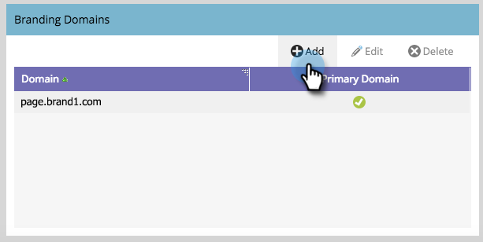

# hinzufügen einer zusätzlichen Branding-Domäne {#add-an-additional-branding-domain}

hinzufügen eine zusätzliche Branding-Domäne, wenn Sie mehrere Marken aus einer einzigen Marketing-Instanz ausführen und sie jeweils über eigene Marken-Tracking-Links verfügen sollen.

>[!NOTE]
>
>**Voraussetzungen**
>
>Sie müssen den generischen Verfolgungslink [durch eine Markendomäne](edit-your-default-branding-domain.md) ersetzen, bevor Sie zusätzliche Markendomänen hinzufügen.

1. Klicken Sie in &quot;My Marketo&quot;auf **Admin **und dann auf den Link **E-Mail** .

   

1. Klicken Sie auf **Hinzufügen **um eine zusätzliche Branding-Domäne hinzuzufügen.

   

1. Geben Sie den Namen Ihrer neuen Markendomäne ein und klicken Sie auf **Speichern**.

   

>[!NOTE]
>
>Sie können festlegen, dass diese Domäne Ihre primäre Domäne ist. Alle vorhandenen nicht gesendeten E-Mails, die auf &quot;Standard&quot;gesetzt sind, und alle neu erstellten E-Mails werden standardmäßig auf die primäre Domäne eingestellt. Sie können dies per E-Mail [überschreiben](overwrite-primary-domain-for-emails.md).

>[!NOTE]
>
>**Verwandte Artikel**
>
>* [Standardmäßige Branding-Domäne bearbeiten](edit-your-default-branding-domain.md)

>

