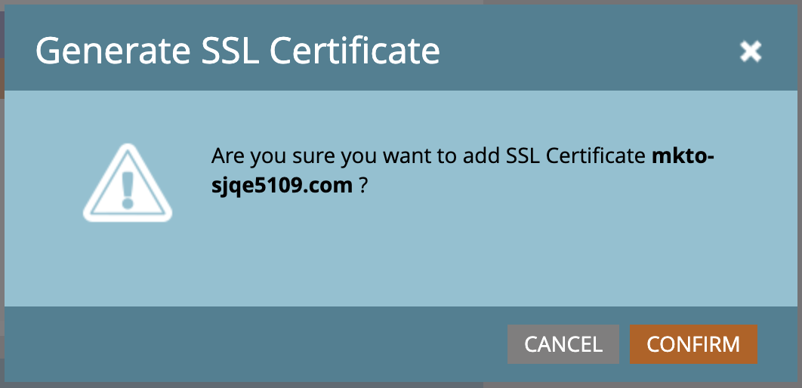

# Hinzufügen einer zusätzlichen Branding-Domain {#add-an-additional-branding-domain}

Fügen Sie eine zusätzliche Branding-Domain hinzu, wenn Sie mehrere Marken von einer Marketo-Instanz aus ausführen und möchten, dass diese jeweils über eigene Branding-Tracking-Links verfügen.

>[!PREREQUISITES]
>
>Sie müssen [ generischen Tracking-Link durch ](/help/marketo/product-docs/administration/email-setup/add-multiple-branding-domains/edit-your-default-branding-domain.md){target="_blank"} Markendomäne ersetzen, bevor Sie weitere Markendomänen hinzufügen.

1. Navigieren Sie zum Bereich **[!UICONTROL Admin]**.

   

1. Klicken Sie auf **[!UICONTROL E-Mail]**.

   

1. Klicken Sie **[!UICONTROL Hinzufügen]**, um eine zusätzliche Branding-Domain hinzuzufügen.

   {width="600"}

1. Geben Sie den Namen Ihrer neuen Branding-Domain ein, wählen Sie _Primäre Domain erstellen_ und/oder _SSL-Zertifikat generieren_ (beide optional) aus und klicken Sie auf **[!UICONTROL Speichern]**.

   

>[!NOTE]
>
>* _Als Primäre Domain festlegen_: Als primäre Domain festlegen, wird für alle bestehenden nicht gesendeten E-Mails der Standardwert festgelegt und für alle neu erstellten E-Mails wird standardmäßig die primäre Domain verwendet. Sie können [dies pro E-Mail überschreiben](/help/marketo/product-docs/administration/email-setup/add-multiple-branding-domains/overwrite-primary-domain-for-emails.md){target="_blank"}.
>
>* _SSL-Zertifikat generieren_: Sie können bei der Erstellung der Domain ein SSL (Secure Sockets Layer) erstellen. Die erste Tracking-Domain initiiert eine einmalige Einrichtung der Infrastruktur, die einige Stunden dauern kann. Sie werden nach Abschluss benachrichtigt, und Sie können dann die erste Domain einrichten. Wenn Sie SSL zu Ihren bestehenden Domains hinzufügen möchten, wenden Sie sich an den [Marketo-Support](https://nation.marketo.com/t5/support/ct-p/Support){target="_blank"}.

## SSLs für bestehende Domains bearbeiten

Führen Sie diese Schritte aus, um SSL für Ihre bestehenden Domains zu aktivieren.

1. Wählen Sie im Bereich _[!UICONTROL Admin]_ die Option **[!UICONTROL E-Mail]** aus.

1. Wählen Sie auf der Registerkarte _[!UICONTROL Domain]_ die Zeile Domain aus und klicken Sie auf **[!UICONTROL SSL hinzufügen]**.

   {width="600"}

1. Klicken Sie im Dialogfeld auf &quot;**[!UICONTROL &quot;]**.

   {width="400"}

## Fehlermeldungen {#error-messages}

<table><thead>
  <tr>
    <th>Fehler</th>
    <th>Details</th>
  </tr></thead>
<tbody>
<tr>
    <td><i>Domäne existiert bereits.</i></td>
    <td>Eine Domain mit demselben Namen ist bereits vorhanden.</td>
  </tr>
  <tr>
    <td><i>Domain ist nicht der Standard-Domain zugeordnet.</i></td>
    <td>Die benutzerdefinierte Domain wird nicht korrekt der Standard-Domain zugeordnet. Überprüfen Sie die Einstellungen der Domain-Zuordnung und stellen Sie sicher, dass die DNS-Konfiguration auf die richtige Standard-Domain verweist.</td>
  </tr>
  <tr>
    <td><i>SSL-Zertifikate konnten aufgrund nicht unterstützter CAA-Einträge nicht ausgestellt werden. Fordern Sie Ihre IT an, Ihre CAA-Einträge zu aktualisieren.</i></td>
    <td>Die CAA-Einträge sind nicht aktuell. Für Benutzer, die von Marketo Engage verwaltete SSL-Zertifikate verwenden, müssen CAA-Einträge auf Zertifikate aktualisiert werden, die von unserem Anbieter empfohlen werden. Bitte wenden Sie sich an Ihre IT-Abteilung, um die CAA-Einträge zu aktualisieren. Weitere Informationen finden <a href="https://nation.marketo.com/t5/product-blogs/changes-to-marketo-engage-secured-domains-platform/ba-p/329305#M2246"> auf </a> Seite .</td>
  </tr>
  <tr>
    <td><i>SSL-Zertifikat wurde bereits ausgestellt.</i></td>
    <td>Für diese benutzerdefinierte Domain ist bereits ein SSL-Zertifikat vorhanden. Es sind keine weiteren Maßnahmen erforderlich, es sei denn, das Zertifikat ist abgelaufen oder muss erneut ausgestellt werden.</td>
  </tr>
  <tr>
    <td><i>Die Standard-Domain wurde nicht gefunden. Bitte wenden Sie sich an den Support, um Hilfe zu erhalten.</i></td>
    <td>Beim Suchen der Standard-Domain ist ein Problem aufgetreten. Bitte wenden Sie sich an den Support, damit er weitere Informationen erhalten kann.</td>
  </tr>
  <tr>
    <td><i>Unerwarteter Fehler beim Erstellen einer Domain. Bitte wenden Sie sich an den Support, um Hilfe zu erhalten.</i></td>
    <td>Ein unerwarteter Fehler ist aufgetreten. Bitte Protokolle und Fehlerdetails sammeln und das Problem an den <a href="https://nation.marketo.com/t5/support/ct-p/Support" target="_blank">Marketo-Support</a> eskalieren.</td>
  </tr>
</tbody></table>

## Zu beachtende Punkte {#things-to-note}

* **DNS-Zuordnung für Domain zu Marketo Engage**: Bevor Sie Domains in der Benutzeroberfläche hinzufügen, müssen Sie [CNAMEs einer von Marketo bereitgestellten Domain zuordnen](https://experienceleague.adobe.com/de/docs/marketo/using/getting-started/initial-setup/setup-steps#customize-your-landing-page-urls-with-a-cname){target="_blank"}.

* **Benutzerdefinierte SSLs**: Wenn Sie eine benutzerdefinierte SSL benötigen, senden Sie ein [Support-Ticket](https://nation.marketo.com/t5/support/ct-p/Support){target="_blank"}. Verwenden Sie nicht das Kontrollkästchen „Self-Service“ für die SSL-Erstellung.

* **Vorhandene SSLs**: Beim Hinzufügen einer Domain sucht das System nach bereits vorhandenen SSLs, die möglicherweise zuvor manuell erstellt wurden. Wenn diese Validierung auftritt, erstellen Sie Ihre Domain, ohne die SSL-Erstellung auszuwählen, und wir werden sie für Sie verbinden. [Support kontaktieren](https://nation.marketo.com/t5/support/ct-p/Support){target="_blank"} weitere Details/Optionen.

* **Löschen von Domains**: Beim automatischen Löschen einer Domain **das SSL** Zertifikat nicht gelöscht. Diese Schutzmaßnahme verhindert Benutzerfehler, die dazu führen, dass eine Website ohne SSL-Zertifikate ist. Wenn Sie die SSL-Zertifikate entfernen möchten, wenden Sie sich [ den Support](https://nation.marketo.com/t5/support/ct-p/Support){target="_blank"}.

>[!MORELIKETHIS]
>
>[Standard-Branding-Domain bearbeiten](/help/marketo/product-docs/administration/email-setup/add-multiple-branding-domains/edit-your-default-branding-domain.md){target="_blank"}
