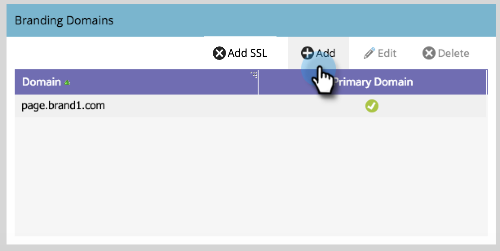

# Hinzufügen einer zusätzlichen Branding-Domain {#add-an-additional-branding-domain}

Fügen Sie eine zusätzliche Branding-Domain hinzu, wenn Sie mehrere Marken von einer Marketo-Instanz aus ausführen und möchten, dass diese jeweils über eigene Branding-Tracking-Links verfügen.

>[!PREREQUISITES]
>
>Sie müssen [ generischen Tracking-Link durch ](/help/marketo/product-docs/administration/email-setup/add-multiple-branding-domains/edit-your-default-branding-domain.md) Markendomäne ersetzen, bevor Sie weitere Markendomänen hinzufügen.

1. Navigieren Sie zum Bereich **[!UICONTROL Admin]**.

   

1. Klicken Sie auf **[!UICONTROL E-Mail]**.

   

1. Klicken Sie **[!UICONTROL Hinzufügen]**, um eine zusätzliche Branding-Domain hinzuzufügen.

   

1. Geben Sie den Namen Ihrer neuen Branding-Domain ein und klicken Sie auf **[!UICONTROL Speichern]**.

   

>[!NOTE]
>
>Sie können diese als primäre Domain festlegen. Alle vorhandenen nicht gesendeten E-Mails werden auf „Standard“ eingestellt und alle neu erstellten E-Mails werden standardmäßig auf die primäre Domain eingestellt. Sie können [pro E-Mail überschreiben](/help/marketo/product-docs/administration/email-setup/add-multiple-branding-domains/overwrite-primary-domain-for-emails.md).

>[!MORELIKETHIS]
>
>[Standard-Branding-Domain bearbeiten](/help/marketo/product-docs/administration/email-setup/add-multiple-branding-domains/edit-your-default-branding-domain.md)
