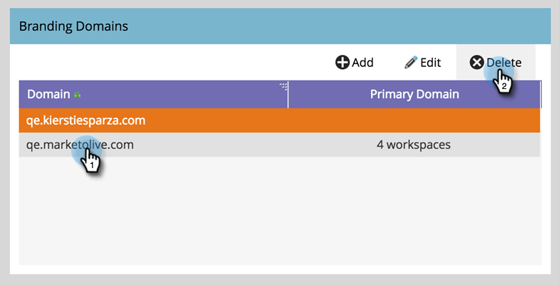

# Löschen einer Branding-Domain {#delete-a-branding-domain}

1. Navigieren Sie zum Bereich **[!UICONTROL Admin]**.

   

1. Klicken Sie auf **[!UICONTROL E-Mail]**.

   

1. Wählen Sie in der Tabelle Branding-Domains die Domain aus, die Sie entfernen möchten, und klicken Sie auf **[!UICONTROL Löschen]**.

   

   >[!NOTE]
   >
   >Wenn Sie die primäre Branding-Domain löschen möchten, müssen Sie zunächst eine andere Branding-Domain als primäre Domain auswählen.
