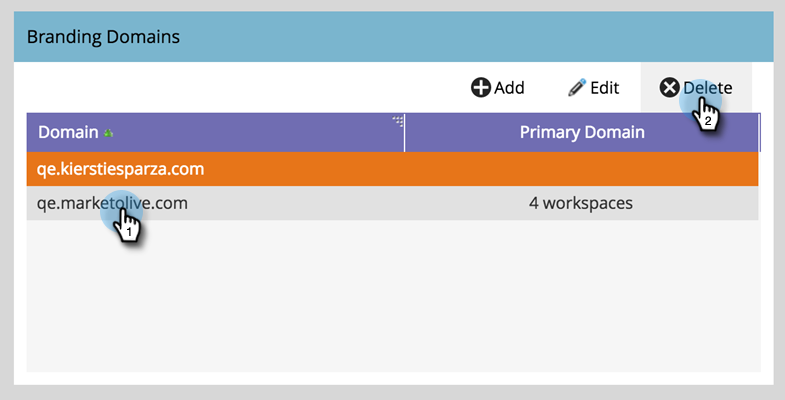

# Eine Branding-Domäne löschen {#delete-a-branding-domain}

1. Navigieren Sie zum **[!UICONTROL Admin]**-Bereich.

   

1. Klicks **[!UICONTROL Email]**.

   

1. Wählen Sie in der Tabelle Branding-Domänen die Domäne aus, die Sie entfernen möchten, und klicken Sie auf **[!UICONTROL Löschen]**.

   

   >[!NOTE]
   >
   >Wenn Sie die primäre Branding-Domäne löschen möchten, müssen Sie zunächst eine andere Branding-Domäne als die primäre Domäne auswählen.
