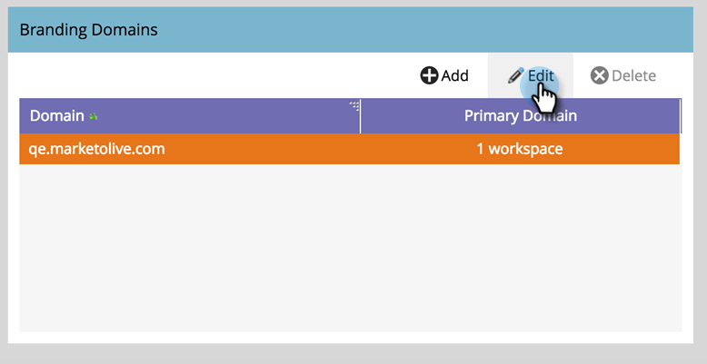

# Bearbeiten Ihrer standardmäßigen Branding-Domain mit Arbeitsbereichen {#edit-your-default-branding-domain-with-workspaces}

1. Navigieren Sie zum Bereich **[!UICONTROL Admin]**.

   

1. Klicken Sie auf **[!UICONTROL E-Mail]**.

   

1. Wählen Sie in [!UICONTROL &#x200B; Tabelle „Branding]Domains“ die aktuelle generische Domain aus und klicken Sie auf **[!UICONTROL Bearbeiten]**, um sie in die Branding-Domain Ihres Unternehmens zu ändern.

   

   >[!NOTE]
   >
   >**[!UICONTROL Hinzufügen]** funktioniert erst, nachdem Sie die generische Domain bearbeitet haben. **[!UICONTROL Löschen]** funktioniert erst, wenn Sie eine zweite Domain hinzufügen.

1. Geben Sie den Namen Ihrer Standard-Domain ein und klicken Sie auf **[!UICONTROL Weiter]**.

   

1. Klicken Sie auf **[!UICONTROL Speichern]**.

   

>[!NOTE]
>
>Beim Hinzufügen zusätzlicher Branding-Domains können Sie festlegen, dass diese Domain als primäre Domain für einen oder mehrere Arbeitsbereiche fungiert. Alle vorhandenen nicht gesendeten E-Mails, die auf „Standard“ eingestellt sind, und alle neu erstellten E-Mails werden standardmäßig auf die primäre Domain gesetzt. Sie können dies für jede E-Mail überschreiben.

Jetzt können Sie [zusätzliche Branding-Domains hinzufügen](/help/marketo/product-docs/administration/email-setup/add-multiple-branding-domains/add-an-additional-branding-domain-with-workspaces.md) die Sie für die Arbeitsbereiche benötigen.
