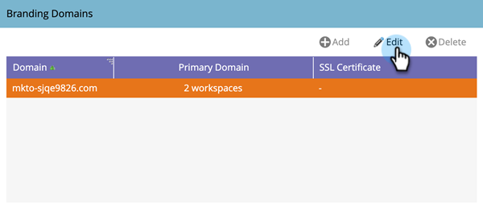

# Standard-Branding-Domain bearbeiten {#edit-your-default-branding-domain}

Das Bearbeiten der Standard-Branding-Domain ist der erste Schritt bei der Arbeit mit Branding-Domains.

>[!PREREQUISITES]
>
>Vergewissern Sie sich, [ Sie einen CNAME in Ihrem DNS eingerichtet haben](/help/marketo/getting-started/initial-setup/configure-protocols-for-marketo.md){target="_blank"} bevor Sie Ihre Branding-Domains in Marketo hinzufügen.

1. Navigieren Sie zum Bereich **[!UICONTROL Admin]**.

   

1. Klicken Sie auf **[!UICONTROL E-Mail]**.

   

1. Wählen Sie in [!UICONTROL &#x200B; Tabelle „Branding]Domains“ die generische Domain aus und klicken Sie auf Bearbeiten , um sie in die Branding-Domain Ihres Unternehmens zu ändern.

   

   >[!NOTE]
   >
   >Sie können erst dann eine zusätzliche Domain hinzufügen, wenn Sie die generische Domain bearbeitet haben.

1. Geben Sie den Namen Ihrer Standard-Domain ein und klicken Sie auf **[!UICONTROL Speichern]**.

   

Jetzt können Sie [alle zusätzlichen Branding-Domains hinzufügen](/help/marketo/product-docs/administration/email-setup/add-multiple-branding-domains/add-an-additional-branding-domain.md){target="_blank"} die Sie benötigen.

>[!NOTE]
>
>Wenn Sie eine vorhandene SSL aktualisieren oder entfernen müssen, wenden Sie sich an den [Marketo-Support](https://nation.marketo.com/t5/support/ct-p/Support){target="_blank"}.
