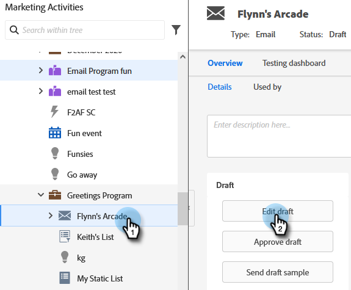

# Primäre Domäne für E-Mails überschreiben {#overwrite-primary-domain-for-emails}

Sie können die primäre Markendomäne pro E-Mail überschreiben. Dies ändert die Art und Weise, wie Links beim Versand der E-Mail gekennzeichnet werden.

1. Wechseln Sie zu **[!UICONTROL Marketingaktivitäten]**.

   

1. Wählen Sie eine E-Mail aus und klicken Sie auf **[!UICONTROL Entwurf bearbeiten]**.

   

1. Wählen Sie die gewünschte Branding-Domäne aus.

   

   >[!NOTE]
   >
   >Nicht alle Benutzer sind berechtigt, die Markendomäne pro E-Mail festzulegen. Wenden Sie sich an Ihren Administrator, wenn die Dropdown-Liste [!UICONTROL Markendomänen] nicht angezeigt wird.
