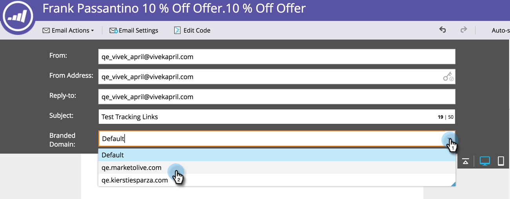

# Primär-Domäne für E-Mails überschreiben {#overwrite-primary-domain-for-emails}

Sie können die primäre Markendomäne per E-Mail überschreiben. Dies ändert die Art und Weise, wie die Links beim Senden der E-Mail gekennzeichnet werden.

1. Gehen Sie zu **Marketing-Aktivitäten**.

   

1. Wählen Sie eine E-Mail aus und klicken Sie auf Entwurf **bearbeiten**.

   

1. Wählen Sie die gewünschte Markendomäne aus.

   

   >[!NOTE]
   >
   >Nicht alle Benutzer sind berechtigt, die Markendomäne per E-Mail festzulegen. Wenden Sie sich an Ihren Administrator, wenn die Dropdownliste &quot;Markendomänen&quot;nicht angezeigt wird.

