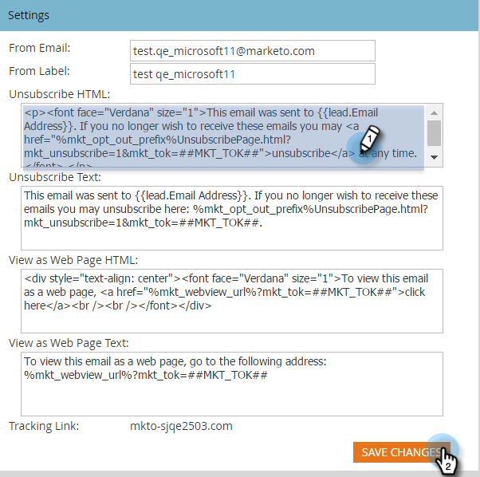

# Die Abmeldung bearbeiten {#edit-the-unsubscribe-message}

>[!NOTE]
>
>**Administratorberechtigungen erforderlich**

Wenn Sie Marketing-E-Mails senden (nicht [funktionsfähig](../../../product-docs/email-marketing/general/functions-in-the-editor/make-an-email-operational.md)), werden Text zum Abbestellen des Abonnements und Links am unteren Rand angehängt. Sie können die Standardwerte ändern. So geht es.

## Die Abmeldung bearbeiten {#edit-the-unsubscribe-message-1}

1. Klicken Sie unter **Admin** auf **E-Mail**.

   

   >[!CAUTION]
   >
   >
   >Die folgenden Variablen sind von entscheidender Bedeutung. Löschen Sie sie nicht!
   >
   >    
   >    
   >    * **%mkt_opt_out_prefix%**
   >    * **mkt_unsubscribe=1&amp;mkt_tok=##MKT_TOK#**

1. Bearbeiten Sie die **Versionen &quot;HTML** abmelden&quot;und &quot;Text **** abmelden&quot;nach Ihren Vorlieben und klicken Sie auf &quot;Änderungen **speichern&quot;**.

   

   Da hast du es. **Stellen Sie sicher, dass Sie es testen!** Sie möchten nicht, dass Ihre Marketing-E-Mails beschädigte Links zum Abmelden aufweisen.

>[!TIP]
>
>Sie können die Position des HTML-Abonnements für die Abmeldung in Ihrer E-Mail mit [Token](../../../product-docs/email-marketing/general/using-tokens/add-a-system-token-as-a-link-in-an-email.md)anpassen.

## Standardtext für Abmeldung {#default-unsubscribe-text}

Wenn Sie jemals zum Standardsystemabonnement zurückkehren müssen, kopieren Sie Folgendes:

HTML abmelden:
`<pre data-theme="Confluence">
If you no longer wish to receive these emails, click on the following link: <a href="%mkt_opt_out_prefix%UnsubscribePage.html?mkt_unsubscribe=1&mkt_tok=##MKT_TOK##">Unsubscribe</a> 
</pre>` Text abmelden:
`<pre data-theme="Confluence">%mkt_opt_out_prefix%UnsubscribePage.html?mkt_unsubscribe=1&mkt_tok=##MKT_TOK##</pre>`

>[!NOTE]
>
>**Verwandte Artikel**
>
>* [Die Meldung &quot;Ansicht als Webseite&quot;bearbeiten](edit-the-view-as-web-page-message.md)

>

