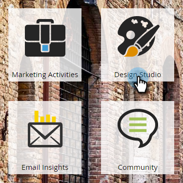

# Dynamische Abmeldung für Sprachen {#make-your-unsubscribe-message-dynamic-for-languages}

Die Standardmeldung und der Link zum Abbestellen des Abonnements sind in Englisch verfügbar. Sie können dynamische Inhalte verwenden, um sie in verschiedenen Sprachen anzuzeigen.

>[!NOTE]
>
>Unten haben wir dieses nette kleine Tutorial für Sie eingerichtet. Es stellt eine Best Practice dar, aber dies kann auf andere Weise erreicht werden.

1. Vorbereiten Ihrer Daten
1. [Erstellen Sie ein benutzerdefiniertes ](../../../../product-docs/administration/field-management/create-a-custom-field-in-marketo.md)Feld mit dem Namen &quot;Bevorzugte Sprache&quot;. (Richten Sie es in Ihrem CRM ein, wenn dieses Feld synchronisiert werden soll).

   >[!TIP]
   >
   >Verwenden Sie dieses Feld in Zukunft, wenn Sie [ein Formular](../../../../product-docs/demand-generation/forms/creating-a-form/create-a-form.md) erstellen, um die Spracheinstellung zu erfassen.

1. Segmentierung erstellen
1. Gehen Sie zur Datenbank ****.
** 

   **

1. Klicken Sie in der Dropdownliste **Neu** auf **Neue Segmentierung**.

   

1. Benennen Sie die Segmentierung **Bevorzugte Sprache**. Klicken Sie auf **Hinzufügen Segment**. Geben Sie eine Sprache ein.

   

   >[!NOTE]
   >
   >Das Standardsegment ist Englisch.

1. Fügen Sie weiterhin Segmente hinzu, bis alle Ihre Sprachen angezeigt werden. Klicken Sie auf **Erstellen**.

   

1. Wählen Sie ein Segment aus.

   

1. Gehen Sie zur Registerkarte **Intelligente Liste**. Geben Sie **Bevorzugte Sprache** in das Suchfeld ein. Ziehen Sie den Filter auf die Arbeitsfläche.

   

1. Legen Sie die entsprechende Sprache fest.

   

1. Wiederholen Sie diese Schritte für alle Ihre Sprachen. Wählen Sie dann die Dropdownliste **Segmentierungsaktionen** und klicken Sie auf **Genehmigen**.

   

1. Snippet erstellen
1. Wechseln Sie zu **Design Studio**.

   

1. Klicken Sie im Dropdownmenü **Neu** auf **Neues Snippet**.

   ** 

   **

1. Benennen Sie das Codefragment **Meldung abmelden**. Klicken Sie auf **Erstellen**.

   

1. Geben Sie die Standardnachricht zum Abmelden ein, markieren Sie sie und klicken Sie auf das Hyperlink-Symbol.

   

1. Kopieren Sie dieses Token und fügen Sie es ein: **`{{system.unsubscribeLink}}`** in das Feld **URL verknüpfen** ein. Klicken Sie auf **Einfügen**.

   

1. Wählen Sie **Segment nach** im Abschnitt Segmentierung.

   

1. Geben Sie in der Dropdownliste Segmentierung **Bevorzugte** ein und wählen Sie **Bevorzugte Sprache**. Klicken Sie auf **Speichern**.

   

1. Wählen Sie ein Segment aus der Struktur. Geben Sie Ihre Nachricht zum Abbestellen in dieser Sprache ein.

   

1. Kopieren Sie dasselbe Token und fügen Sie es ein: **`{{system.unsubscribeLink}}`** in das Feld **URL verknüpfen** ein. Klicken Sie auf **Einfügen**.

   

1. Wiederholen Sie diese Schritte für alle Ihre Segmente. Gehen Sie dann zurück zu Design Studio, klicken Sie auf die Dropdownliste **Codeausschnittaktionen** und klicken Sie auf **Genehmigen**.

   

   Fantastisch. Fast da.

1. Snippet in einer E-Mail verwenden
1. Klicken Sie im E-Mail-Editor auf das bearbeitbare Element. Klicken Sie dann auf das Zahnradsymbol und wählen Sie **Ersetzen durch Ausschnitt**. Wenn Sie ein bearbeitbares Snippet-Element auswählen, klicken Sie auf das Zahnradsymbol und wählen Sie **Bearbeiten**.

   

1. Suchen Sie nach Ihrem Snippet und wählen Sie es aus der Dropdownliste aus und klicken Sie auf **Speichern**.

   

1. Klicken Sie zum Testen auf **Zurück**...

   

1. ...dann die Registerkarte **Dynamisch**.

   

1. Klicken Sie auf die verschiedenen Sprachen, um die Änderung des Snippets anzuzeigen.

   

   >[!TIP]
   >
   >Natürlich können Sie den Rest Ihrer E-Mail auch für dynamische Sprachen bearbeiten. Während Sie sich daran befinden, führen Sie auf der Seite zum Abmelden das gleiche Verfahren aus.

1. Anpassen Ihrer Abmeldeseite mit dynamischem Inhalt

   Wenn Sie möchten, dass Ihre Mitarbeiter eine Abmeldeseite in ihrer bevorzugten Sprache aufrufen, können Sie dynamische Inhalte auf der Landingpage und der Bestätigungsseite verwenden.

   Navigieren Sie zum Design Studio.

   

   Geben Sie im Suchfeld Abmelden ein. Sie sollten Ihre Abmeldeseiten finden.

   

   Klicken Sie auf Entwurf bearbeiten.

   

   Wählen Sie Segment nach.

   

   Suchen Sie das Segment Bevorzugte Sprache. Klicken Sie auf Speichern.

   

   Bearbeiten Sie Ihre Inhalte für jede Landingpage, genehmigen Sie, und Sie sind gut zu gehen!

   >[!NOTE]
   >
   >**Tieftauchen**
   >
   >
   >Erfahren Sie mehr über [dynamische Inhalte](../../../../product-docs/personalization/segmentation-and-snippets/segmentation/understanding-dynamic-content.md) und alle coolen Dinge, die Sie tun können.

