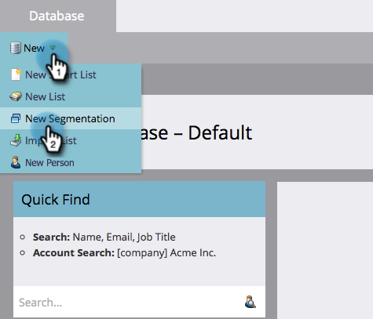
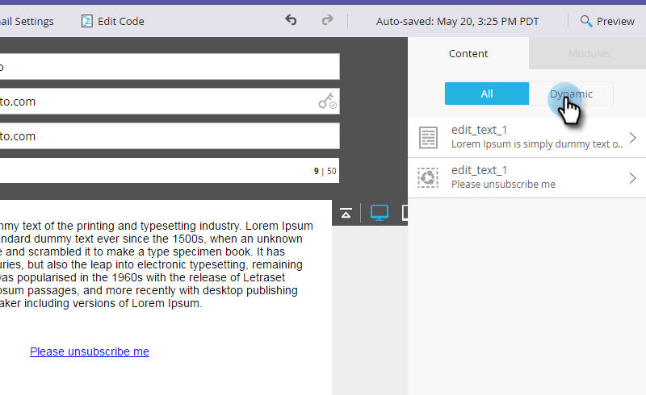

# Dynamische Abmeldemeldung für Sprachen {#make-your-unsubscribe-message-dynamic-for-languages}

Die Standard-Abmelde-Nachricht und der entsprechende Link sind in englischer Sprache verfügbar. Sie können dynamische Inhalte verwenden, um sie in verschiedenen Sprachen anzuzeigen.

>[!NOTE]
>
>Dieser Artikel stellt eine Best Practice dar, kann aber auf andere Weise durchgeführt werden.

## Daten vorbereiten {#prepare-your-data}

1. [Benutzerdefiniertes Feld erstellen](/help/marketo/product-docs/administration/field-management/create-a-custom-field-in-marketo.md) namens &quot;Bevorzugte Sprache&quot;. (Richten Sie es in Ihrem CRM ein, wenn dieses Feld synchronisiert werden soll).

   >[!TIP]
   >
   >Verwenden Sie dieses Feld zukünftig, wenn Sie [Erstellen eines Formulars](/help/marketo/product-docs/demand-generation/forms/creating-a-form/create-a-form.md) , um die Sprachvoreinstellung zu erfassen.

## Segmentierung erstellen {#create-segmentation}

1. Navigieren Sie zu **Datenbank**.

   

1. Im **Neu** Dropdown, klicken Sie auf **Neue Segmentierung**.

   

1. Benennen Sie die Segmentierung. **Bevorzugte Sprache**. Klicken **Segment hinzufügen**. Geben Sie eine Sprache ein.

   

   >[!NOTE]
   >
   >Das Standardsegment ist Englisch.

1. Fügen Sie weiterhin Segmente hinzu, bis alle Ihre Sprachen repräsentiert sind. Klicken Sie auf **Erstellen**.

   

1. Segment auswählen.

   

1. Wechseln Sie zur Registerkarte **Intelligente Liste.** Eingabe **Bevorzugte Sprache** in das Suchfeld ein. Ziehen Sie den Filter auf die Arbeitsfläche.

   

1. Legen Sie die entsprechende Sprache fest.

   

1. Wiederholen Sie diese Schritte für alle Ihre Sprachen. Wählen Sie anschließend die **Segmentierungsaktionen** Dropdown-Liste und klicken Sie auf **Genehmigen**.

   

## Snippet erstellen {#create-a-snippet}

1. Navigieren Sie zu **Design Studio**.

   

1. Im **Neu** Dropdown, klicken **Neuer Snippet**.

   

1. Benennen Sie das Snippet. **Abmelde-Nachricht**. Klicken Sie auf **Erstellen**.

   

1. Geben Sie Ihre standardmäßige Abmelde-Nachricht ein, markieren Sie sie und klicken Sie auf das Hyperlink-Symbol.

   

1. Kopieren Sie dieses Token und fügen Sie es ein: `{{system.unsubscribeLink}}` in **URL** -Feld. Klicken Sie auf **Einfügen**.

   

1. Auswählen **Segment nach** im Abschnitt Segmentierung .

   

1. Geben Sie in der Dropdown-Liste Segmentierung **Bevorzugt** und wählen Sie **Bevorzugte Sprache**. Klicken **Speichern**.

   

1. Wählen Sie ein Segment aus der Baumstruktur aus. Klicken Sie auf Ihre Abmeldung und dann auf das Link-Symbol.

   

1. Stellen Sie sicher `{{system.unsubscribeLink}}` befindet sich weiterhin im Feld URL . Bearbeiten Sie den Anzeigetext entsprechend der ausgewählten Sprache. Klicken **Anwenden**.

   

1. Wiederholen Sie diese Schritte für alle Ihre Segmente. Gehen Sie dann zurück zu Design Studio und klicken Sie auf das **Snippet-Aktionen** und klicken Sie auf **Genehmigen**.

   

Fantastisch. Fast da!

## Snippet in einer E-Mail verwenden {#use-snippet-in-an-email}

1. Klicken Sie im E-Mail-Editor auf das bearbeitbare Element. Klicken Sie dann auf das Zahnradsymbol und wählen Sie **Ersetzen durch Snippet**. Wenn Sie ein bearbeitbares Snippet-Element auswählen, klicken Sie auf das Zahnradsymbol und wählen Sie **Bearbeiten**.

   

1. Suchen und wählen Sie Ihr Snippet aus der Dropdown-Liste aus und klicken Sie auf **Speichern**.

   

1. Um es auszuprobieren, klicken Sie auf **Zurück**...

   

1. ...dann die **Dynamik** Registerkarte.

   

1. Klicken Sie auf die verschiedenen Sprachen, um die Änderung des Snippets anzuzeigen.

   

   >[!TIP]
   >
   >Natürlich können Sie den Rest Ihrer E-Mail auch für dynamische Sprachen bearbeiten. Führen Sie auf der Abmeldeseite die gleiche Technik aus, während Sie damit arbeiten.

## Anpassen der Abmeldeseite mit dynamischen Inhalten {#customizing-your-unsubscribe-page-with-dynamic-content}

Wenn Sie möchten, dass Ihre Personen zu einer Abmeldeseite in der gewünschten Sprache gelangen, können Sie dynamischen Inhalt auf der Landingpage und der Bestätigungsseite verwenden.

1. Navigieren Sie zum **Design Studio**.

   

1. Geben Sie ein _Abmelden_ in das Suchfeld ein und wählen Sie die gewünschte Abmeldeseite aus.

   

1. Klicken **Entwurf bearbeiten**.

   

1. Auswählen **Segment nach**.

   

1. Suchen Sie das Segment Bevorzugte Sprache . Klicken **Speichern**.

   

   Bearbeiten Sie den Inhalt für jede Landingpage, validieren Sie, und Sie können loslegen!

   >[!NOTE]
   >
   >Weitere Informationen [dynamischer Inhalt](/help/marketo/product-docs/personalization/segmentation-and-snippets/segmentation/understanding-dynamic-content.md) und all die coolen Sachen, die man machen kann.
