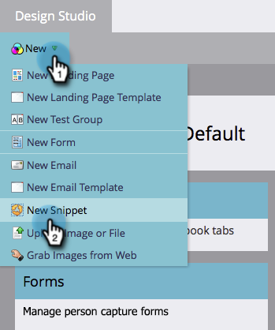
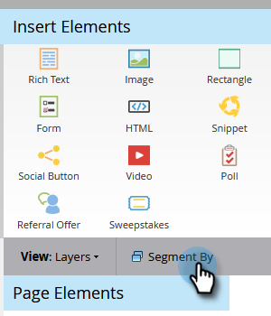

# Machen Sie Ihre Abmelde-Nachricht dynamisch für Sprachen {#make-your-unsubscribe-message-dynamic-for-languages}

Die standardmäßige Abmelde-Nachricht und der Link sind in englischer Sprache. Sie können dynamische Inhalte verwenden, um sie in verschiedenen Sprachen anzuzeigen.

>[!NOTE]
>
>Dieser Artikel stellt eine Best Practice dar, kann aber auch auf andere Weise erreicht werden.

## Daten vorbereiten {#prepare-your-data}

1. [Erstellen Sie ein benutzerdefiniertes Feld ](/help/marketo/product-docs/administration/field-management/create-a-custom-field-in-marketo.md) dem Namen „Bevorzugte Sprache“. (Richten Sie es in Ihrem CRM ein, wenn Sie dieses Feld synchronisieren möchten).

   >[!TIP]
   >
   >Verwenden Sie dieses Feld in Zukunft, wenn Sie [Formular erstellen](/help/marketo/product-docs/demand-generation/forms/creating-a-form/create-a-form.md) um Spracheinstellungen zu erfassen.

## Segmentierung erstellen {#create-segmentation}

1. Navigieren Sie zur **[!UICONTROL Datenbank]**.

   

1. Klicken Sie in der **[!UICONTROL Neu]** Dropdown-Liste auf **[!UICONTROL Neue Segmentierung]**.

   

1. Benennen Sie die **[!UICONTROL (Bevorzugte Sprache]**. Klicken Sie **[!UICONTROL Segment hinzufügen]**. Geben Sie in einer Sprache ein.

   

   >[!NOTE]
   >
   >Das Standardsegment ist Englisch.

1. Fügen Sie weitere Segmente hinzu, bis alle Ihre Sprachen angezeigt werden. Klicken Sie auf **[!UICONTROL Erstellen]**.

   

1. Segment auswählen.

   

1. Navigieren Sie zur Registerkarte **[!UICONTROL Smart-Liste]**. Geben Sie **[!UICONTROL Bevorzugte Sprache]** in das Suchfeld ein. Ziehen Sie den Filter auf die Arbeitsfläche.

   

1. Legen Sie die entsprechende Sprache fest.

   

1. Wiederholen Sie den Vorgang für alle Ihre verschiedenen Sprachen. Wählen Sie dann die Dropdown **[!UICONTROL Liste Segmentierungsaktionen]** klicken Sie auf **[!UICONTROL Genehmigen]**.

   

## Erstellen eines Snippets {#create-a-snippet}

1. Gehen Sie zum **[!UICONTROL Design Studio]**.

   

1. Klicken Sie im Dropdown **[!UICONTROL Neu]** auf **[!UICONTROL Neues Snippet]**.

   

1. Benennen Sie das Snippet **Nachricht abmelden**. Klicken Sie auf **[!UICONTROL Erstellen]**.

   

1. Geben Sie die Standardmeldung zum Abmelden ein, markieren Sie sie und klicken Sie auf das Hyperlink-Symbol.

   

1. Kopieren Sie dieses Token und fügen Sie es `{{system.unsubscribeLink}}` in das Feld **[!UICONTROL URL]** ein. Klicken Sie auf **[!UICONTROL Einfügen]**.

   

1. Wählen **[!UICONTROL Abschnitt**[!UICONTROL  Segmentierung ]**die Option „Segment nach]** aus.

   

1. Geben Sie in **[!UICONTROL Dropdown]** Segmentierung“ in **[!UICONTROL Bevorzugte]** ein und wählen Sie **[!UICONTROL Bevorzugte Sprache]**. Klicken Sie auf **[!UICONTROL Speichern]**.

   

1. Wählen Sie ein Segment aus der Baumstruktur aus. Klicken Sie auf Ihr Abo kündigen und dann auf das Link-Symbol.

   

1. Stellen Sie sicher, dass sich `{{system.unsubscribeLink}}` noch im Feld **[!UICONTROL URL]** befindet. Bearbeiten Sie den **[!UICONTROL Text anzeigen]** entsprechend der ausgewählten Sprache. Klicken Sie auf **[!UICONTROL Übernehmen]**.

   

1. Wiederholen Sie den Vorgang für alle Segmente. Gehen Sie dann zurück zum **[!UICONTROL Design Studio]**, klicken Sie auf die **[!UICONTROL Snippet-Aktionen]** und klicken Sie auf **[!UICONTROL Genehmigen]**.

   

Fantastisch. Fast da!

## Snippet in einer E-Mail verwenden {#use-snippet-in-an-email}

1. Klicken Sie im E-Mail-Editor auf das bearbeitbare Element. Klicken Sie dann auf das Zahnradsymbol und wählen Sie **[!UICONTROL Ersetzen durch Snippet]** aus. Wenn Sie ein bearbeitbares Snippet-Element auswählen, klicken Sie auf das Zahnradsymbol und wählen Sie **[!UICONTROL Bearbeiten]** aus.

   

1. Suchen Sie Ihr Snippet, wählen Sie es aus der Dropdown-Liste aus und klicken Sie auf **[!UICONTROL Speichern]**.

   

1. Klicken Sie zum Testen auf **[!UICONTROL Zurück]**…

   

1. …dann die Registerkarte **[!UICONTROL Dynamisch]**.

   

1. Klicken Sie auf die verschiedenen Sprachen, um die Änderung des Ausschnitts anzuzeigen.

   

   >[!TIP]
   >
   >Natürlich können Sie auch den Rest Ihrer E-Mail für dynamische Sprachen bearbeiten. Führen Sie, während Sie dabei sind, dieselbe Technik auf der Seite zum Abmelden aus.

## Abmeldeseite mit dynamischen Inhalten anpassen {#customizing-your-unsubscribe-page-with-dynamic-content}

Wenn Sie möchten, dass Ihre Besucher auf eine Abmeldeseite in ihrer bevorzugten Sprache kommen, können Sie dynamische Inhalte auf der Landingpage und der Bestätigungsseite verwenden.

1. Navigieren Sie zu **[!UICONTROL Design Studio]**.

   

1. Geben Sie im Suchfeld _Abo beenden_ ein und wählen Sie die gewünschte Abmeldeseite aus.

   

1. Klicken Sie **[!UICONTROL Entwurf bearbeiten]**.

   

1. Wählen Sie **[!UICONTROL Segment nach]** aus.

   

1. Suchen Sie das Segment **[!UICONTROL Bevorzugte Sprache]**. Klicken Sie auf **[!UICONTROL Speichern]**.

   

   Bearbeiten Sie Ihre Inhalte für jede Landingpage, genehmigen Sie sie, und schon können Sie loslegen!

   >[!NOTE]
   >
   >Erfahren Sie mehr über [dynamische Inhalte](/help/marketo/product-docs/personalization/segmentation-and-snippets/segmentation/understanding-dynamic-content.md) und all die coolen Dinge, die Sie tun können.
