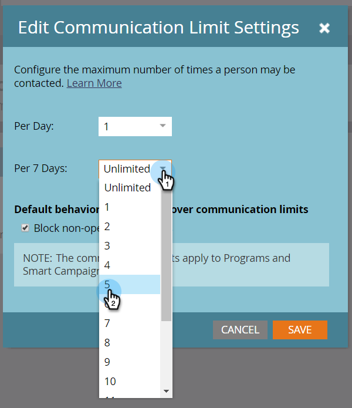
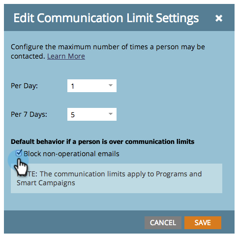

# Aktivieren von Kommunikationsbeschränkungen {#enable-communication-limits}

Es ist wichtig, nicht zu viel mit seinen Leuten zu kommunizieren. Das Festlegen von Kommunikationsbeschränkungen verhindert, dass Ihr Unternehmen zu viele E-Mails sendet.

>[!NOTE]
>
>**Admin-Berechtigungen erforderlich**

1. Navigieren Sie zum Bereich **[!UICONTROL Admin]**.

   

1. Klicken Sie **[!UICONTROL Kommunikationsbeschränkungen]**.

   

1. Klicken Sie auf **[!UICONTROL Bearbeiten]**.

   

   >[!NOTE]
   >
   >[!UICONTROL Pro Tag] basiert auf dem Kalendertag in der Zeitzone des Abonnements (Mitternacht-Mitternacht).

1. Klicken Sie auf **[!UICONTROL pro Tag]** und wählen Sie das gewünschte Limit aus. In diesem Beispiel wird 1 verwendet.

   

   >[!TIP]
   >
   >Sie können auch **[!UICONTROL Benutzerdefiniert]** auswählen, wenn keine der voreingestellten Optionen für Sie funktioniert.

1. Klicken Sie auf **[!UICONTROL Dropdown-Liste Pro 7]** und wählen Sie das gewünschte Limit aus. In diesem Beispiel wird 5 verwendet.

   

1. Wählen Sie **[!UICONTROL Nicht-operative E-Mails blockieren]** aus.

   

   >[!NOTE]
   >
   >Erfahren Sie mehr über [operative E-Mails](/help/marketo/product-docs/email-marketing/general/functions-in-the-editor/make-an-email-operational.md).

1. Klicken Sie auf **[!UICONTROL Speichern]**.

   

   >[!NOTE]
   >
   >**Beispiel**
   >
   >Die oben genannten Einstellungen bedeuten, dass Personen nicht mehr als **1 E-Mail pro Tag** mehr als **5 in einem Zeitraum von sieben Tagen erhalten**.

   >[!NOTE]
   >
   >Die Kommunikationsbeschränkungen gelten automatisch für alle E-Mail- und Interaktionsprogramme.

>[!MORELIKETHIS]
>
>[Kommunikationsbeschränkungen anwenden auf [!DNL Smart Campaign]](/help/marketo/product-docs/core-marketo-concepts/smart-campaigns/using-smart-campaigns/apply-communication-limits-to-smart-campaign.md)
